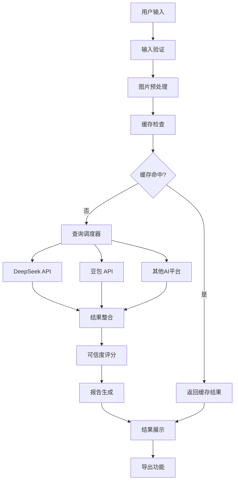

# AI大模型查询功能模块 - 产品需求文档

## 1. 产品概述

AI大模型查询功能模块是相亲对象背调专家系统的核心智能分析引擎，通过集成多个主流AI大模型平台，实现对相亲对象的智能化背景调查和信息分析。该模块支持文本和图片多模态输入，能够自动调度多个AI平台进行并行查询，并生成结构化的背调报告。

- 核心价值：通过AI技术提升背调效率和准确性，为用户提供可靠的相亲对象信息分析服务
- 目标用户：需要进行相亲对象背景调查的个人用户、婚恋平台、婚介机构等
- 市场价值：填补传统背调服务在效率、成本和准确性方面的空白，提供智能化的背调解决方案

## 2. 核心功能

### 2.1 用户角色

| 角色 | 注册方式 | 核心权限 |
|------|----------|----------|
| 普通用户 | 邮箱注册 | 可进行基础查询，每日查询次数限制，查看基础报告 |
| 高级用户 | 付费升级 | 无限查询次数，查看详细报告，导出功能，历史记录管理 |
| 管理员 | 系统分配 | 系统管理，用户管理，查询监控，数据统计分析 |

### 2.2 功能模块

AI大模型查询功能模块包含以下核心页面：
1. **查询输入页面**：多模态信息输入，支持文本和图片上传
2. **查询进度页面**：实时显示多平台查询状态和进度
3. **结果分析页面**：展示AI分析结果和可信度评分
4. **报告生成页面**：结构化报告展示和导出功能
5. **查询历史页面**：历史查询记录管理和删除
6. **模型配置页面**：AI模型参数配置和优先级设置

### 2.3 页面详情

| 页面名称 | 模块名称 | 功能描述 |
|----------|----------|----------|
| 查询输入页面 | 信息输入模块 | 接收用户输入的姓名、图片等信息，支持多种格式，提供输入验证和预处理 |
| 查询输入页面 | 图片处理模块 | 自动压缩、格式转换、质量优化，适配不同AI平台要求 |
| 查询进度页面 | 查询调度器 | 多平台并行查询，实时状态监控，失败重试机制，进度可视化 |
| 查询进度页面 | 缓存管理 | 检查本地缓存，避免重复查询，提升响应速度 |
| 结果分析页面 | 结果整合 | 汇总多平台查询结果，去重处理，数据标准化 |
| 结果分析页面 | 可信度评分 | 基于多源信息交叉验证，生成可信度评分和置信区间 |
| 报告生成页面 | 报告模板 | 结构化报告生成，包含基本信息、社交资料、风险评估等 |
| 报告生成页面 | 导出功能 | 支持PDF、Excel格式导出，自定义报告模板 |
| 查询历史页面 | 记录管理 | 查询历史浏览、搜索、筛选，支持批量删除 |
| 查询历史页面 | 隐私保护 | 数据加密存储，用户可控删除，符合隐私法规 |
| 模型配置页面 | 模型管理 | AI模型选择、参数配置、优先级设置，性能监控 |

## 3. 核心流程

### 3.1 用户查询流程
1. 用户登录系统，选择AI查询功能
2. 输入相亲对象姓名和上传相关图片
3. 系统进行输入验证和图片预处理
4. 查询调度器分发任务到多个AI平台
5. 实时显示查询进度和各平台状态
6. 收集并整合各平台返回结果
7. 生成可信度评分和结构化报告
8. 用户查看报告并可选择导出

### 3.2 管理员监控流程
1. 管理员登录后台管理系统
2. 查看系统整体查询状态和性能指标
3. 监控各AI平台的响应时间和成功率
4. 处理异常查询和用户反馈
5. 调整模型配置和系统参数

## 4. 用户界面设计

### 4.1 设计风格
- **主色调**：深蓝色 (#1e3a8a) 和科技蓝 (#3b82f6)，体现专业性和科技感
- **辅助色**：白色 (#ffffff)、浅灰 (#f8fafc)、成功绿 (#10b981)、警告橙 (#f59e0b)、错误红 (#ef4444)
- **按钮样式**：圆角设计，渐变效果，悬停动画
- **字体**：主要使用 Inter 字体，中文使用思源黑体，代码使用 JetBrains Mono
- **布局风格**：卡片式设计，响应式布局，左侧导航栏
- **图标风格**：线性图标，统一的视觉语言，支持深色模式

### 4.2 页面设计概览

| 页面名称 | 模块名称 | UI元素 |
|----------|----------|--------|
| 查询输入页面 | 信息输入区域 | 大型输入框，拖拽上传区域，实时预览，进度指示器 |
| 查询输入页面 | 图片处理区域 | 图片预览，压缩选项，格式转换状态，质量调节滑块 |
| 查询进度页面 | 进度监控面板 | 环形进度条，平台状态卡片，实时日志，预计完成时间 |
| 结果分析页面 | 结果展示区域 | 数据可视化图表，可信度仪表盘，信息对比表格，标签云 |
| 报告生成页面 | 报告预览区域 | 分页预览，模板选择器，自定义选项，导出按钮组 |
| 查询历史页面 | 历史记录列表 | 时间轴布局，搜索筛选栏，批量操作按钮，删除确认弹窗 |

### 4.3 响应式设计
- **桌面端优先**：主要针对桌面端用户设计，提供完整功能体验
- **移动端适配**：关键功能在移动端可用，简化操作流程
- **触摸优化**：移动端增大点击区域，优化手势操作

## 5. 技术要求

### 5.1 性能指标
- **响应时间**：平均查询响应时间 ≤ 10秒
- **并发能力**：支持每秒5次并发查询
- **系统可用性**：99.9%系统可用性保证
- **缓存命中率**：≥ 80%的查询缓存命中率
- **错误率**：API调用错误率 ≤ 1%

### 5.2 安全要求
- **数据传输**：全程HTTPS加密传输
- **数据存储**：敏感数据AES-256加密存储
- **访问控制**：基于JWT的身份认证和权限控制
- **隐私保护**：用户可控的数据删除机制
- **合规性**：符合《个人信息保护法》等相关法规

### 5.3 集成要求
- **AI平台集成**：DeepSeek、豆包、GPT-4V等主流大模型
- **图片处理**：支持JPG、PNG、WebP等常见格式
- **导出格式**：PDF、Excel、Word等多种格式支持
- **监控告警**：集成系统监控和异常告警机制