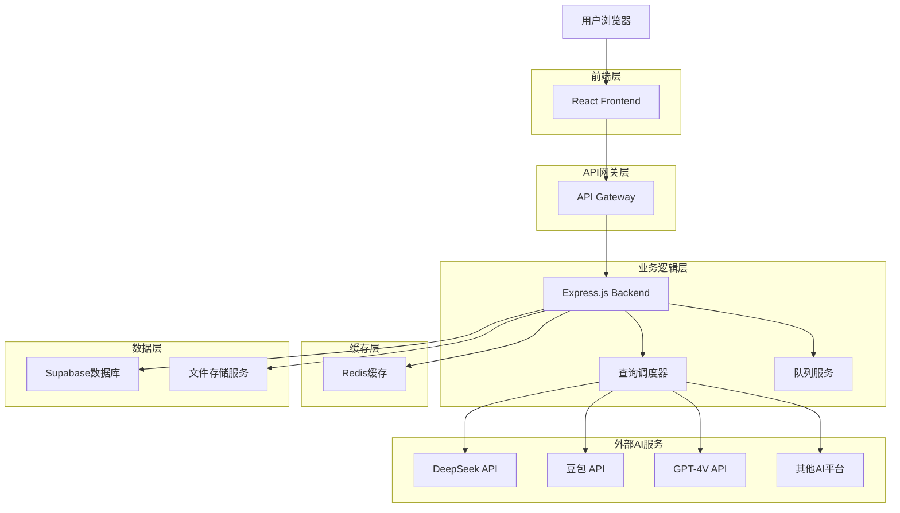
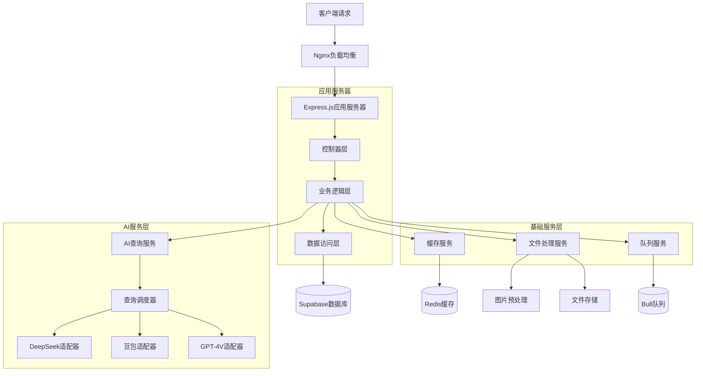
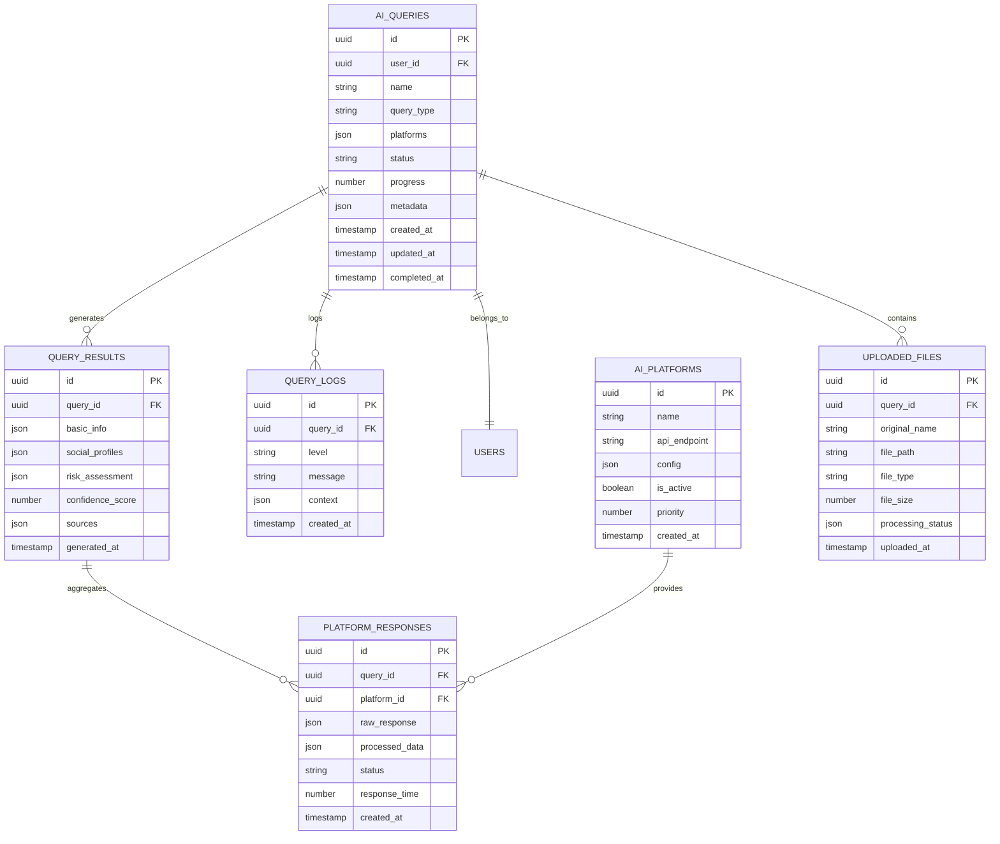

# AI大模型查询功能模块 - 技术架构文档

## 1. 架构设计



## 2. 技术描述

- **前端**: React@18 + TypeScript + Tailwind CSS + Vite + Zustand
- **后端**: Express.js@4 + TypeScript + JWT认证 + Multer文件上传
- **数据库**: Supabase (PostgreSQL) + Redis缓存
- **AI集成**: DeepSeek SDK + 豆包API + OpenAI SDK + 自定义适配器
- **图片处理**: Sharp + Canvas API + WebP转换
- **队列服务**: Bull Queue + Redis
- **文件存储**: Supabase Storage + 本地临时存储
- **监控**: Winston日志 + 自定义性能监控

## 3. 路由定义

| 路由 | 用途 |
|------|------|
| /ai-query | AI查询主页面，展示查询输入界面 |
| /ai-query/input | 信息输入页面，支持文本和图片上传 |
| /ai-query/progress/:queryId | 查询进度页面，实时显示查询状态 |
| /ai-query/results/:queryId | 查询结果页面，展示AI分析结果 |
| /ai-query/report/:queryId | 报告生成页面，结构化报告展示 |
| /ai-query/history | 查询历史页面，历史记录管理 |
| /ai-query/settings | 模型配置页面，AI参数设置 |

## 4. API定义

### 4.1 核心API

#### 查询提交接口
```
POST /api/ai-query/submit
```

Request:
| 参数名称 | 参数类型 | 是否必需 | 描述 |
|----------|----------|----------|------|
| name | string | true | 查询对象姓名 |
| images | File[] | false | 上传的图片文件数组 |
| queryType | string | true | 查询类型：basic/advanced/comprehensive |
| platforms | string[] | false | 指定查询平台，默认全部 |

Response:
| 参数名称 | 参数类型 | 描述 |
|----------|----------|------|
| queryId | string | 查询任务ID |
| status | string | 查询状态 |
| estimatedTime | number | 预计完成时间（秒） |

#### 查询状态接口
```
GET /api/ai-query/status/:queryId
```

Response:
| 参数名称 | 参数类型 | 描述 |
|----------|----------|------|
| queryId | string | 查询任务ID |
| status | string | 查询状态：pending/running/completed/failed |
| progress | number | 完成进度百分比 |
| platforms | object[] | 各平台查询状态详情 |
| results | object | 查询结果（完成时） |

#### 结果获取接口
```
GET /api/ai-query/results/:queryId
```

Response:
| 参数名称 | 参数类型 | 描述 |
|----------|----------|------|
| queryId | string | 查询任务ID |
| results | object | 整合后的查询结果 |
| confidence | number | 可信度评分 |
| sources | string[] | 信息来源平台 |
| generatedAt | string | 生成时间 |

#### 报告导出接口
```
POST /api/ai-query/export/:queryId
```

Request:
| 参数名称 | 参数类型 | 是否必需 | 描述 |
|----------|----------|----------|------|
| format | string | true | 导出格式：pdf/excel/word |
| template | string | false | 报告模板ID |
| sections | string[] | false | 包含的报告章节 |

Response:
| 参数名称 | 参数类型 | 描述 |
|----------|----------|------|
| downloadUrl | string | 文件下载链接 |
| fileSize | number | 文件大小（字节） |
| expiresAt | string | 链接过期时间 |

### 4.2 AI平台适配器API

#### DeepSeek查询接口
```
POST /api/ai-platforms/deepseek/query
```

#### 豆包查询接口
```
POST /api/ai-platforms/doubao/query
```

#### 通用AI查询接口
```
POST /api/ai-platforms/generic/query
```

## 5. 服务器架构图



## 6. 数据模型

### 6.1 数据模型定义



### 6.2 数据定义语言

#### AI查询表 (ai_queries)
```sql
-- 创建AI查询表
CREATE TABLE ai_queries (
    id UUID PRIMARY KEY DEFAULT gen_random_uuid(),
    user_id UUID NOT NULL REFERENCES users(id) ON DELETE CASCADE,
    name VARCHAR(255) NOT NULL,
    query_type VARCHAR(50) NOT NULL CHECK (query_type IN ('basic', 'advanced', 'comprehensive')),
    platforms JSONB DEFAULT '[]',
    status VARCHAR(50) DEFAULT 'pending' CHECK (status IN ('pending', 'running', 'completed', 'failed', 'cancelled')),
    progress INTEGER DEFAULT 0 CHECK (progress >= 0 AND progress <= 100),
    metadata JSONB DEFAULT '{}',
    created_at TIMESTAMP WITH TIME ZONE DEFAULT NOW(),
    updated_at TIMESTAMP WITH TIME ZONE DEFAULT NOW(),
    completed_at TIMESTAMP WITH TIME ZONE
);

-- 创建索引
CREATE INDEX idx_ai_queries_user_id ON ai_queries(user_id);
CREATE INDEX idx_ai_queries_status ON ai_queries(status);
CREATE INDEX idx_ai_queries_created_at ON ai_queries(created_at DESC);
```

#### 查询结果表 (query_results)
```sql
-- 创建查询结果表
CREATE TABLE query_results (
    id UUID PRIMARY KEY DEFAULT gen_random_uuid(),
    query_id UUID NOT NULL REFERENCES ai_queries(id) ON DELETE CASCADE,
    basic_info JSONB DEFAULT '{}',
    social_profiles JSONB DEFAULT '{}',
    risk_assessment JSONB DEFAULT '{}',
    confidence_score DECIMAL(5,2) CHECK (confidence_score >= 0 AND confidence_score <= 100),
    sources JSONB DEFAULT '[]',
    generated_at TIMESTAMP WITH TIME ZONE DEFAULT NOW()
);

-- 创建索引
CREATE INDEX idx_query_results_query_id ON query_results(query_id);
CREATE INDEX idx_query_results_confidence ON query_results(confidence_score DESC);
```

#### AI平台表 (ai_platforms)
```sql
-- 创建AI平台表
CREATE TABLE ai_platforms (
    id UUID PRIMARY KEY DEFAULT gen_random_uuid(),
    name VARCHAR(100) NOT NULL UNIQUE,
    api_endpoint VARCHAR(500) NOT NULL,
    config JSONB DEFAULT '{}',
    is_active BOOLEAN DEFAULT true,
    priority INTEGER DEFAULT 1,
    created_at TIMESTAMP WITH TIME ZONE DEFAULT NOW()
);

-- 插入初始数据
INSERT INTO ai_platforms (name, api_endpoint, config, priority) VALUES
('DeepSeek', 'https://api.deepseek.com/v1', '{"model": "deepseek-chat", "max_tokens": 4000}', 1),
('豆包', 'https://ark.cn-beijing.volces.com/api/v3', '{"model": "doubao-pro-4k", "temperature": 0.7}', 2),
('GPT-4V', 'https://api.openai.com/v1', '{"model": "gpt-4-vision-preview", "max_tokens": 3000}', 3);
```

#### 平台响应表 (platform_responses)
```sql
-- 创建平台响应表
CREATE TABLE platform_responses (
    id UUID PRIMARY KEY DEFAULT gen_random_uuid(),
    query_id UUID NOT NULL REFERENCES ai_queries(id) ON DELETE CASCADE,
    platform_id UUID NOT NULL REFERENCES ai_platforms(id),
    raw_response JSONB,
    processed_data JSONB,
    status VARCHAR(50) DEFAULT 'pending' CHECK (status IN ('pending', 'success', 'failed', 'timeout')),
    response_time INTEGER, -- 响应时间（毫秒）
    created_at TIMESTAMP WITH TIME ZONE DEFAULT NOW()
);

-- 创建索引
CREATE INDEX idx_platform_responses_query_id ON platform_responses(query_id);
CREATE INDEX idx_platform_responses_platform_id ON platform_responses(platform_id);
CREATE INDEX idx_platform_responses_status ON platform_responses(status);
```

#### 查询日志表 (query_logs)
```sql
-- 创建查询日志表
CREATE TABLE query_logs (
    id UUID PRIMARY KEY DEFAULT gen_random_uuid(),
    query_id UUID NOT NULL REFERENCES ai_queries(id) ON DELETE CASCADE,
    level VARCHAR(20) NOT NULL CHECK (level IN ('info', 'warn', 'error', 'debug')),
    message TEXT NOT NULL,
    context JSONB DEFAULT '{}',
    created_at TIMESTAMP WITH TIME ZONE DEFAULT NOW()
);

-- 创建索引
CREATE INDEX idx_query_logs_query_id ON query_logs(query_id);
CREATE INDEX idx_query_logs_level ON query_logs(level);
CREATE INDEX idx_query_logs_created_at ON query_logs(created_at DESC);
```

#### 上传文件表 (uploaded_files)
```sql
-- 创建上传文件表
CREATE TABLE uploaded_files (
    id UUID PRIMARY KEY DEFAULT gen_random_uuid(),
    query_id UUID NOT NULL REFERENCES ai_queries(id) ON DELETE CASCADE,
    original_name VARCHAR(255) NOT NULL,
    file_path VARCHAR(500) NOT NULL,
    file_type VARCHAR(50) NOT NULL,
    file_size INTEGER NOT NULL,
    processing_status JSONB DEFAULT '{"status": "pending"}',
    uploaded_at TIMESTAMP WITH TIME ZONE DEFAULT NOW()
);

-- 创建索引
CREATE INDEX idx_uploaded_files_query_id ON uploaded_files(query_id);
CREATE INDEX idx_uploaded_files_file_type ON uploaded_files(file_type);
```

## 7. 安全架构

### 7.1 数据加密
- **传输加密**: TLS 1.3 + HTTPS
- **存储加密**: AES-256-GCM 对敏感数据加密
- **API密钥管理**: 环境变量 + 密钥轮换机制

### 7.2 访问控制
- **身份认证**: JWT Token + 刷新令牌机制
- **权限控制**: RBAC基于角色的访问控制
- **API限流**: Redis + 滑动窗口算法

### 7.3 隐私保护
- **数据最小化**: 只收集必要信息
- **用户控制**: 用户可删除查询记录
- **合规性**: 符合GDPR、个人信息保护法等法规

## 8. 性能优化

### 8.1 缓存策略
- **查询缓存**: Redis缓存相同查询结果，TTL 24小时
- **图片缓存**: 处理后的图片缓存，TTL 7天
- **API响应缓存**: 平台API响应缓存，TTL 1小时

### 8.2 并发处理
- **队列系统**: Bull Queue处理异步任务
- **连接池**: 数据库连接池优化
- **负载均衡**: Nginx反向代理 + 多实例部署

### 8.3 监控告警
- **性能监控**: 响应时间、吞吐量、错误率
- **资源监控**: CPU、内存、磁盘使用率
- **业务监控**: 查询成功率、平台可用性