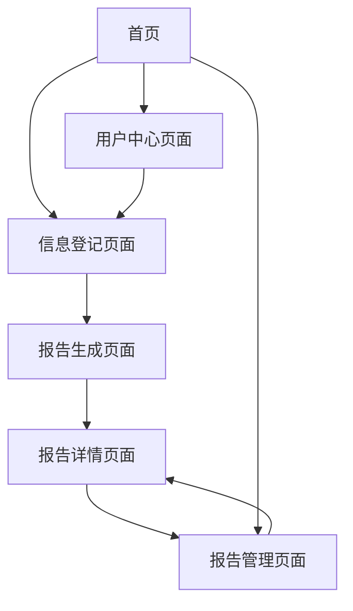

# 智能相亲调查报告系统 - 产品需求文档

## 1. 产品概述

智能相亲调查报告系统是一个基于AI技术的专业相亲背景调查平台，通过用户信息收集、心理测试问卷和智能分析算法，自动生成详细的个人背景调查报告。系统旨在帮助用户全面了解潜在交往对象，提供科学的匹配度评估和专业的分析建议。

该系统解决了传统相亲过程中信息不透明、匹配度难以量化、缺乏专业分析等问题，为现代单身人士提供更加科学、客观的相亲决策支持工具。

目标市场价值：面向25-45岁的都市单身人群，预计可服务百万级用户，提升相亲成功率30%以上。

## 2. 核心功能

### 2.1 用户角色

| 角色 | 注册方式 | 核心权限 |
|------|----------|----------|
| 普通用户 | 手机号/邮箱注册 | 填写个人信息、查看基础报告、下载简版PDF |
| 高级用户 | 付费升级 | 完整心理测试、详细分析报告、高级数据可视化、无限下载 |
| 管理员 | 内部分配 | 系统管理、数据统计、用户管理、报告审核 |

### 2.2 功能模块

我们的智能相亲调查报告系统包含以下主要页面：

1. **信息登记页面**：基本信息收集、心理测试问卷、兴趣爱好调查
2. **报告生成页面**：智能分析处理、进度展示、结果预览
3. **报告详情页面**：完整报告展示、数据可视化、互动分析
4. **报告管理页面**：历史报告列表、对比分析、批量操作
5. **用户中心页面**：个人设置、会员管理、使用统计

### 2.3 页面详情

| 页面名称 | 模块名称 | 功能描述 |
|----------|----------|----------|
| 信息登记页面 | 基本信息模块 | 收集姓名、年龄、职业、教育背景、收入等基础信息 |
| 信息登记页面 | 心理测试模块 | 包含性格测试、价值观评估、情感倾向等专业问卷 |
| 信息登记页面 | 兴趣爱好模块 | 收集兴趣爱好、生活方式、社交偏好等个性化信息 |
| 信息登记页面 | 择偶要求模块 | 详细的择偶标准、期望条件、重要性权重设置 |
| 报告生成页面 | 数据处理模块 | 实时显示分析进度、数据验证、AI处理状态 |
| 报告生成页面 | 预览模块 | 生成完成后的快速预览、关键指标展示 |
| 报告详情页面 | 基本信息汇总 | 用户信息整理、关键数据提取、信息脱敏处理 |
| 报告详情页面 | 性格分析模块 | 基于心理测试的性格特征分析、优势劣势评估 |
| 报告详情页面 | 匹配度分析 | 兴趣爱好匹配度、价值观契合度、生活方式兼容性 |
| 报告详情页面 | 数据可视化 | 雷达图展示性格维度、柱状图显示匹配度、饼图分析价值观 |
| 报告详情页面 | 综合评分 | 潜在匹配度总分、各维度得分、改进建议 |
| 报告详情页面 | 导出功能 | PDF报告生成、图片导出、数据备份 |
| 报告管理页面 | 报告列表 | 历史报告查看、搜索筛选、状态管理 |
| 报告管理页面 | 对比分析 | 多份报告对比、趋势分析、匹配度排序 |
| 用户中心页面 | 个人设置 | 基本信息修改、隐私设置、通知偏好 |
| 用户中心页面 | 会员管理 | 套餐选择、支付管理、使用记录 |

## 3. 核心流程

### 用户操作流程

用户首先进入信息登记页面，依次完成基本信息填写、心理测试问卷和兴趣爱好调查。系统实时验证数据完整性和准确性，确保信息质量。完成后进入报告生成页面，AI系统开始智能分析处理，用户可实时查看分析进度。生成完成后自动跳转到报告详情页面，用户可查看完整的分析报告、数据可视化图表，并可下载PDF格式报告。用户还可在报告管理页面查看历史记录和进行对比分析。

### 页面导航流程图

## 4. 用户界面设计

### 4.1 设计风格

- **主色调**：温暖的玫瑰金 (#E91E63) 和深蓝色 (#1976D2)，营造专业而温馨的氛围
- **辅助色**：浅粉色 (#FCE4EC)、浅蓝色 (#E3F2FD)、中性灰 (#F5F5F5)
- **按钮风格**：圆角设计，渐变色彩，悬停效果，体现现代感和专业性
- **字体**：主标题使用 24-32px 粗体，正文使用 14-16px 常规字体，确保可读性
- **布局风格**：卡片式设计，清晰的层次结构，充足的留白空间
- **图标风格**：线性图标配合填充图标，统一的视觉语言，增强用户体验

### 4.2 页面设计概览

| 页面名称 | 模块名称 | UI元素 |
|----------|----------|---------|
| 信息登记页面 | 基本信息模块 | 表单输入框、下拉选择器、单选按钮，采用分步骤向导式设计，进度条显示完成状态 |
| 信息登记页面 | 心理测试模块 | 问卷题目卡片、滑动评分条、多选题组件，温馨的色彩搭配和友好的提示文案 |
| 报告生成页面 | 数据处理模块 | 动态进度条、处理状态指示器、预估时间显示，使用动画效果增强用户体验 |
| 报告详情页面 | 数据可视化 | 雷达图、柱状图、饼图、环形图，采用渐变色彩和交互式设计 |
| 报告详情页面 | 综合评分 | 大数字显示、星级评分、进度环形图，突出关键指标 |
| 报告管理页面 | 报告列表 | 卡片式布局、筛选器、搜索框、分页组件，支持网格和列表两种视图 |

### 4.3 响应式设计

系统采用移动优先的响应式设计策略，支持桌面端、平板端和移动端的完美适配。桌面端采用多列布局充分利用屏幕空间，移动端采用单列布局确保内容清晰可读。所有交互元素都针对触屏操作进行了优化，确保在不同设备上都能提供流畅的用户体验。

## 5. 技术要求

### 5.1 前端技术栈
- **框架**：React 18 + TypeScript，确保类型安全和开发效率
- **样式**：Tailwind CSS 3，快速构建响应式界面
- **状态管理**：Zustand，轻量级状态管理解决方案
- **路由**：React Router 6，支持嵌套路由和懒加载
- **数据可视化**：Chart.js + React-Chartjs-2，丰富的图表类型
- **PDF生成**：jsPDF + html2canvas，高质量PDF导出
- **表单处理**：React Hook Form，高性能表单验证

### 5.2 后端集成
- **AI服务**：GLM-4.6 API，提供智能分析和报告生成
- **数据存储**：Supabase PostgreSQL，可靠的数据持久化
- **文件存储**：Supabase Storage，PDF和图片文件管理
- **身份认证**：Supabase Auth，安全的用户认证系统

### 5.3 性能要求
- **报告生成时间**：5秒内完成分析和报告生成
- **页面加载速度**：首屏加载时间不超过2秒
- **数据可视化**：图表渲染时间不超过1秒
- **PDF生成**：10秒内完成PDF文件生成和下载

### 5.4 安全和隐私
- **数据脱敏**：自动识别和处理敏感信息
- **权限控制**：基于角色的访问控制系统
- **数据加密**：传输和存储数据全程加密
- **隐私保护**：符合GDPR和国内隐私保护法规