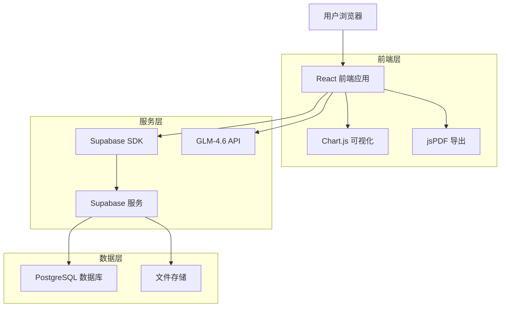
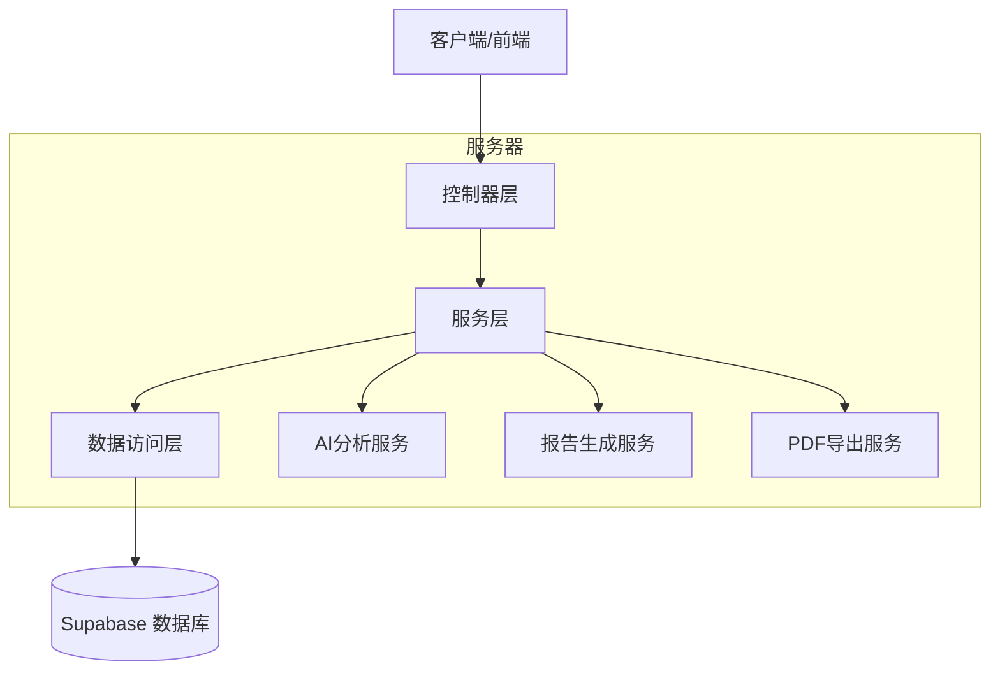
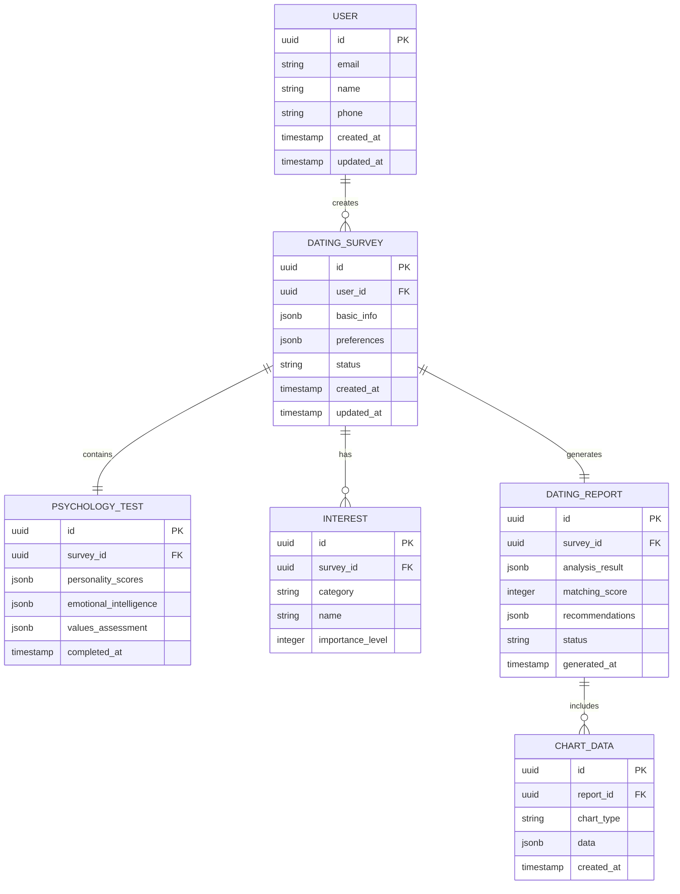

# 智能相亲调查报告系统 - 技术架构文档

## 1. 架构设计



## 2. 技术描述

- **前端**：React@18 + TypeScript + Tailwind CSS@3 + Vite + Chart.js + jsPDF
- **后端**：Supabase (PostgreSQL + Auth + Storage)
- **AI服务**：GLM-4.6 API
- **状态管理**：Zustand
- **数据可视化**：Chart.js + React-Chartjs-2

## 3. 路由定义

| 路由 | 用途 |
|------|------|
| /dating-survey | 相亲信息登记页面，包含基本信息、心理测试和兴趣爱好调查 |
| /report-generation/:id | 报告生成页面，显示AI分析进度和处理状态 |
| /dating-report/:id | 相亲调查报告详情页面，展示完整分析结果和数据可视化 |
| /reports | 报告管理页面，历史报告列表和对比分析功能 |
| /profile | 用户中心页面，个人设置和会员管理 |

## 4. API定义

### 4.1 核心API

相亲调查数据提交
```
POST /api/dating-survey
```

请求参数：
| 参数名称 | 参数类型 | 是否必填 | 描述 |
|----------|----------|----------|------|
| basicInfo | object | true | 基本信息对象 |
| psychologyTest | object | true | 心理测试结果 |
| interests | array | true | 兴趣爱好列表 |
| preferences | object | true | 择偶要求 |

响应参数：
| 参数名称 | 参数类型 | 描述 |
|----------|----------|------|
| surveyId | string | 调查记录ID |
| status | string | 提交状态 |

示例：
```json
{
  "basicInfo": {
    "name": "张三",
    "age": 28,
    "occupation": "软件工程师",
    "education": "本科",
    "income": "10k_20k"
  },
  "psychologyTest": {
    "personality": {
      "extroversion": 7,
      "agreeableness": 8,
      "conscientiousness": 9
    }
  },
  "interests": ["阅读", "旅行", "运动"],
  "preferences": {
    "ageRange": [25, 35],
    "education": "本科以上"
  }
}
```

报告生成API
```
POST /api/generate-report
```

请求参数：
| 参数名称 | 参数类型 | 是否必填 | 描述 |
|----------|----------|----------|------|
| surveyId | string | true | 调查记录ID |
| analysisType | string | true | 分析类型 |

响应参数：
| 参数名称 | 参数类型 | 描述 |
|----------|----------|------|
| reportId | string | 报告ID |
| progress | number | 生成进度 |
| estimatedTime | number | 预估完成时间 |

报告详情获取
```
GET /api/dating-report/:id
```

响应参数：
| 参数名称 | 参数类型 | 描述 |
|----------|----------|------|
| reportData | object | 完整报告数据 |
| visualData | object | 可视化图表数据 |
| matchingScore | number | 综合匹配度评分 |

### 4.2 数据可视化API

图表数据获取
```
GET /api/chart-data/:reportId
```

响应参数：
| 参数名称 | 参数类型 | 描述 |
|----------|----------|------|
| personalityRadar | object | 性格雷达图数据 |
| matchingBar | object | 匹配度柱状图数据 |
| valuesPie | object | 价值观饼图数据 |

PDF生成API
```
POST /api/generate-pdf
```

请求参数：
| 参数名称 | 参数类型 | 是否必填 | 描述 |
|----------|----------|----------|------|
| reportId | string | true | 报告ID |
| template | string | true | PDF模板类型 |

响应参数：
| 参数名称 | 参数类型 | 描述 |
|----------|----------|------|
| pdfUrl | string | PDF下载链接 |
| fileSize | number | 文件大小 |

## 5. 服务器架构图



## 6. 数据模型

### 6.1 数据模型定义



### 6.2 数据定义语言

用户表 (users)
```sql
-- 创建用户表
CREATE TABLE users (
    id UUID PRIMARY KEY DEFAULT gen_random_uuid(),
    email VARCHAR(255) UNIQUE NOT NULL,
    name VARCHAR(100) NOT NULL,
    phone VARCHAR(20),
    avatar_url TEXT,
    membership_type VARCHAR(20) DEFAULT 'basic' CHECK (membership_type IN ('basic', 'premium', 'vip')),
    created_at TIMESTAMP WITH TIME ZONE DEFAULT NOW(),
    updated_at TIMESTAMP WITH TIME ZONE DEFAULT NOW()
);

-- 创建索引
CREATE INDEX idx_users_email ON users(email);
CREATE INDEX idx_users_membership ON users(membership_type);
```

相亲调查表 (dating_surveys)
```sql
-- 创建相亲调查表
CREATE TABLE dating_surveys (
    id UUID PRIMARY KEY DEFAULT gen_random_uuid(),
    user_id UUID REFERENCES users(id) ON DELETE CASCADE,
    basic_info JSONB NOT NULL,
    preferences JSONB NOT NULL,
    status VARCHAR(20) DEFAULT 'pending' CHECK (status IN ('pending', 'processing', 'completed', 'failed')),
    created_at TIMESTAMP WITH TIME ZONE DEFAULT NOW(),
    updated_at TIMESTAMP WITH TIME ZONE DEFAULT NOW()
);

-- 创建索引
CREATE INDEX idx_dating_surveys_user_id ON dating_surveys(user_id);
CREATE INDEX idx_dating_surveys_status ON dating_surveys(status);
CREATE INDEX idx_dating_surveys_created_at ON dating_surveys(created_at DESC);
```

心理测试表 (psychology_tests)
```sql
-- 创建心理测试表
CREATE TABLE psychology_tests (
    id UUID PRIMARY KEY DEFAULT gen_random_uuid(),
    survey_id UUID REFERENCES dating_surveys(id) ON DELETE CASCADE,
    personality_scores JSONB NOT NULL,
    emotional_intelligence JSONB,
    values_assessment JSONB,
    completed_at TIMESTAMP WITH TIME ZONE DEFAULT NOW()
);

-- 创建索引
CREATE INDEX idx_psychology_tests_survey_id ON psychology_tests(survey_id);
```

兴趣爱好表 (interests)
```sql
-- 创建兴趣爱好表
CREATE TABLE interests (
    id UUID PRIMARY KEY DEFAULT gen_random_uuid(),
    survey_id UUID REFERENCES dating_surveys(id) ON DELETE CASCADE,
    category VARCHAR(50) NOT NULL,
    name VARCHAR(100) NOT NULL,
    importance_level INTEGER DEFAULT 5 CHECK (importance_level BETWEEN 1 AND 10),
    created_at TIMESTAMP WITH TIME ZONE DEFAULT NOW()
);

-- 创建索引
CREATE INDEX idx_interests_survey_id ON interests(survey_id);
CREATE INDEX idx_interests_category ON interests(category);
```

相亲报告表 (dating_reports)
```sql
-- 创建相亲报告表
CREATE TABLE dating_reports (
    id UUID PRIMARY KEY DEFAULT gen_random_uuid(),
    survey_id UUID REFERENCES dating_surveys(id) ON DELETE CASCADE,
    analysis_result JSONB NOT NULL,
    matching_score INTEGER CHECK (matching_score BETWEEN 0 AND 100),
    recommendations JSONB,
    status VARCHAR(20) DEFAULT 'generating' CHECK (status IN ('generating', 'completed', 'failed')),
    generated_at TIMESTAMP WITH TIME ZONE DEFAULT NOW(),
    pdf_url TEXT
);

-- 创建索引
CREATE INDEX idx_dating_reports_survey_id ON dating_reports(survey_id);
CREATE INDEX idx_dating_reports_status ON dating_reports(status);
CREATE INDEX idx_dating_reports_matching_score ON dating_reports(matching_score DESC);
```

图表数据表 (chart_data)
```sql
-- 创建图表数据表
CREATE TABLE chart_data (
    id UUID PRIMARY KEY DEFAULT gen_random_uuid(),
    report_id UUID REFERENCES dating_reports(id) ON DELETE CASCADE,
    chart_type VARCHAR(50) NOT NULL,
    data JSONB NOT NULL,
    created_at TIMESTAMP WITH TIME ZONE DEFAULT NOW()
);

-- 创建索引
CREATE INDEX idx_chart_data_report_id ON chart_data(report_id);
CREATE INDEX idx_chart_data_type ON chart_data(chart_type);

-- 权限设置
GRANT SELECT ON users TO anon;
GRANT ALL PRIVILEGES ON users TO authenticated;
GRANT SELECT ON dating_surveys TO anon;
GRANT ALL PRIVILEGES ON dating_surveys TO authenticated;
GRANT ALL PRIVILEGES ON psychology_tests TO authenticated;
GRANT ALL PRIVILEGES ON interests TO authenticated;
GRANT ALL PRIVILEGES ON dating_reports TO authenticated;
GRANT ALL PRIVILEGES ON chart_data TO authenticated;

-- 初始化数据
INSERT INTO users (email, name, membership_type) VALUES 
('demo@example.com', '演示用户', 'premium'),
('test@example.com', '测试用户', 'basic');
```