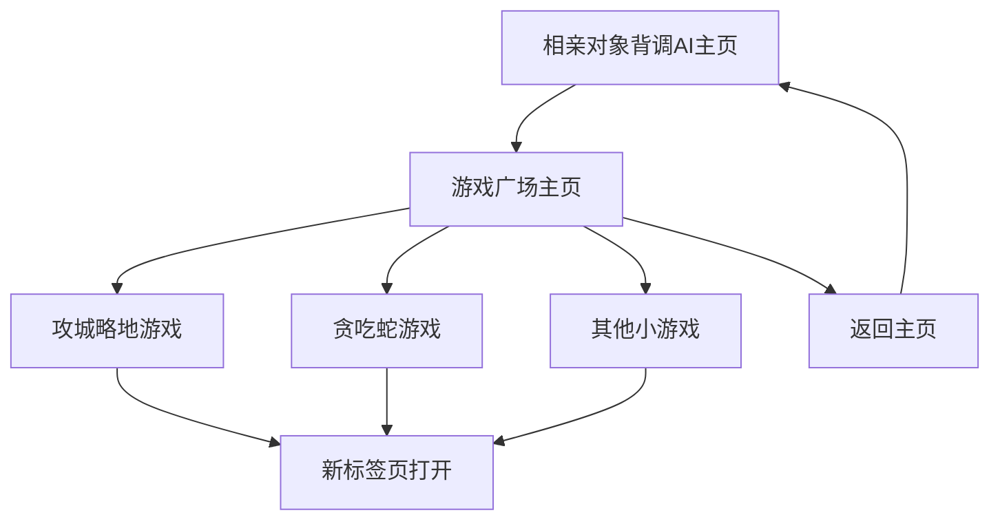

# 游戏广场 - 产品需求文档

## 1. 产品概述
游戏广场是一个专业的游戏导航平台，作为相亲对象背调AI主页到攻城略地网站的核心跳转枢纽。
- 主要目的：为用户提供统一的游戏入口，提升用户体验和游戏发现能力，增强平台粘性。
- 目标用户：相亲对象背调AI的现有用户群体，寻求娱乐放松的用户。
- 市场价值：通过游戏化运营增加用户停留时间，提升平台整体活跃度和用户满意度。

## 2. 核心功能

### 2.1 用户角色
本产品无需复杂的用户角色区分，所有访问用户享有相同的浏览和游戏访问权限。

### 2.2 功能模块
游戏广场包含以下核心页面：
1. **游戏广场主页**：主视觉展示区、游戏网格区、导航栏
2. **游戏详情预览**：游戏介绍弹窗、快速预览功能

### 2.3 页面详情

| 页面名称 | 模块名称 | 功能描述 |
|---------|---------|---------|
| 游戏广场主页 | 顶部导航栏 | 显示返回相亲对象背调AI主页按钮，保持品牌一致性 |
| 游戏广场主页 | 主视觉展示区 | 突出展示攻城略地游戏入口，占首屏50%以上面积，包含推荐角标和特殊视觉效果 |
| 游戏广场主页 | 游戏网格区 | 展示其他益智小游戏入口，包含贪吃蛇、俄罗斯方块等经典游戏卡片 |
| 游戏广场主页 | 游戏卡片 | 实现动态加载效果、悬停动画、游戏预览图和描述信息 |
| 游戏详情预览 | 预览弹窗 | 显示游戏截图、简介、玩法说明和直接跳转按钮 |

## 3. 核心流程

**用户操作流程：**
1. 用户从相亲对象背调AI主页点击"攻城略地"按钮
2. 跳转到游戏广场主页
3. 用户可以选择攻城略地（主推游戏）或其他小游戏
4. 点击游戏卡片在新标签页打开对应游戏
5. 用户可通过顶部导航返回相亲对象背调AI主页

## 4. 用户界面设计

### 4.1 设计风格
- **主色调**：#3B82F6（蓝色）作为主色，#10B981（绿色）作为辅助色
- **按钮样式**：圆角设计（border-radius: 8px），带有渐变效果和悬停动画
- **字体**：主标题使用24-32px，副标题18-20px，正文14-16px，优先使用系统字体
- **布局风格**：卡片式布局，网格排列，响应式设计适配移动端
- **图标风格**：使用现代扁平化图标，支持游戏主题的emoji表情

### 4.2 页面设计概览

| 页面名称 | 模块名称 | UI元素 |
|---------|---------|--------|
| 游戏广场主页 | 顶部导航栏 | 白色背景，左侧返回按钮（蓝色#3B82F6），右侧标题"游戏广场" |
| 游戏广场主页 | 主视觉展示区 | 渐变背景（蓝色到紫色），大尺寸攻城略地卡片，右上角"推荐"角标（红色#EF4444） |
| 游戏广场主页 | 游戏网格区 | 2x2或3x3网格布局，每个卡片包含游戏图标、名称和简介，悬停时放大1.05倍 |
| 游戏详情预览 | 预览弹窗 | 半透明黑色遮罩，白色弹窗，圆角设计，包含关闭按钮和跳转按钮 |

### 4.3 响应式设计
- **桌面端优先**：主要针对1200px以上屏幕优化
- **移动端适配**：768px以下使用单列布局，游戏卡片堆叠排列
- **触摸优化**：按钮最小点击区域44px，支持触摸手势操作