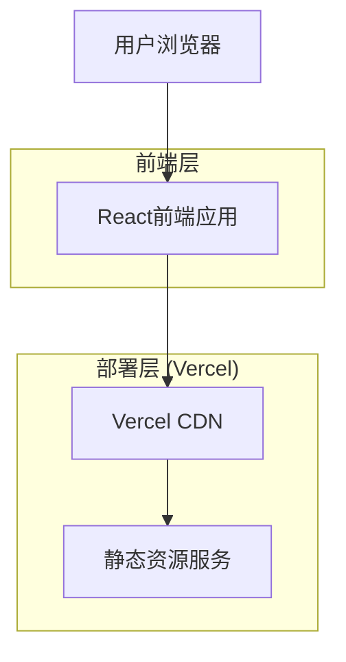
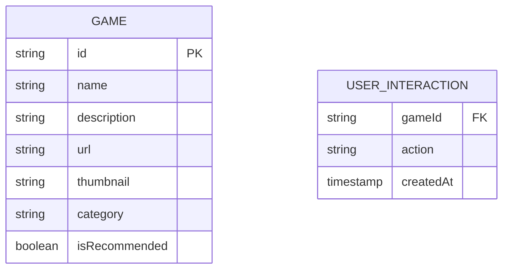

# 游戏广场 - 技术架构文档

## 1. 架构设计



## 2. 技术描述
- 前端：React@18 + TypeScript + Tailwind CSS + Vite
- 部署：Vercel (静态站点托管)

## 3. 路由定义

| 路由 | 用途 |
|------|-----|
| / | 游戏广场主页，展示所有游戏入口和导航 |
| /preview/:gameId | 游戏详情预览页面（可选实现） |

## 4. API定义
本项目为纯前端静态站点，无需后端API。所有游戏跳转通过外部链接实现。

### 4.1 外部游戏链接配置

游戏数据结构：
```typescript
interface Game {
  id: string;
  name: string;
  description: string;
  url: string;
  thumbnail: string;
  category: 'featured' | 'puzzle' | 'action' | 'casual';
  isRecommended?: boolean;
}
```

示例配置：
```json
{
  "games": [
    {
      "id": "battle-game",
      "name": "攻城略地",
      "description": "策略战争游戏，征服领土扩张版图",
      "url": "https://traejyo6r3ez.vercel.app/",
      "thumbnail": "/images/battle-game.jpg",
      "category": "featured",
      "isRecommended": true
    },
    {
      "id": "snake-game",
      "name": "贪吃蛇",
      "description": "经典益智游戏，控制蛇吃食物成长",
      "url": "#",
      "thumbnail": "/images/snake-game.jpg",
      "category": "puzzle"
    }
  ]
}
```

## 5. 数据模型

### 5.1 数据模型定义
本项目使用静态数据配置，无需数据库。



### 5.2 本地存储结构
使用localStorage存储用户交互数据：

```typescript
// 用户游戏访问记录
interface GameVisit {
  gameId: string;
  visitCount: number;
  lastVisited: string;
}

// 用户偏好设置
interface UserPreferences {
  favoriteGames: string[];
  theme: 'light' | 'dark';
  animations: boolean;
}
```

本地存储键值：
```
localStorage.setItem('gameVisits', JSON.stringify(visits));
localStorage.setItem('userPreferences', JSON.stringify(preferences));
```