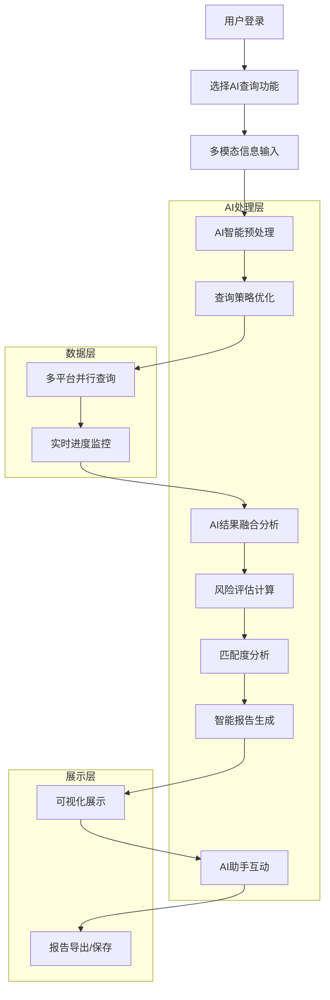
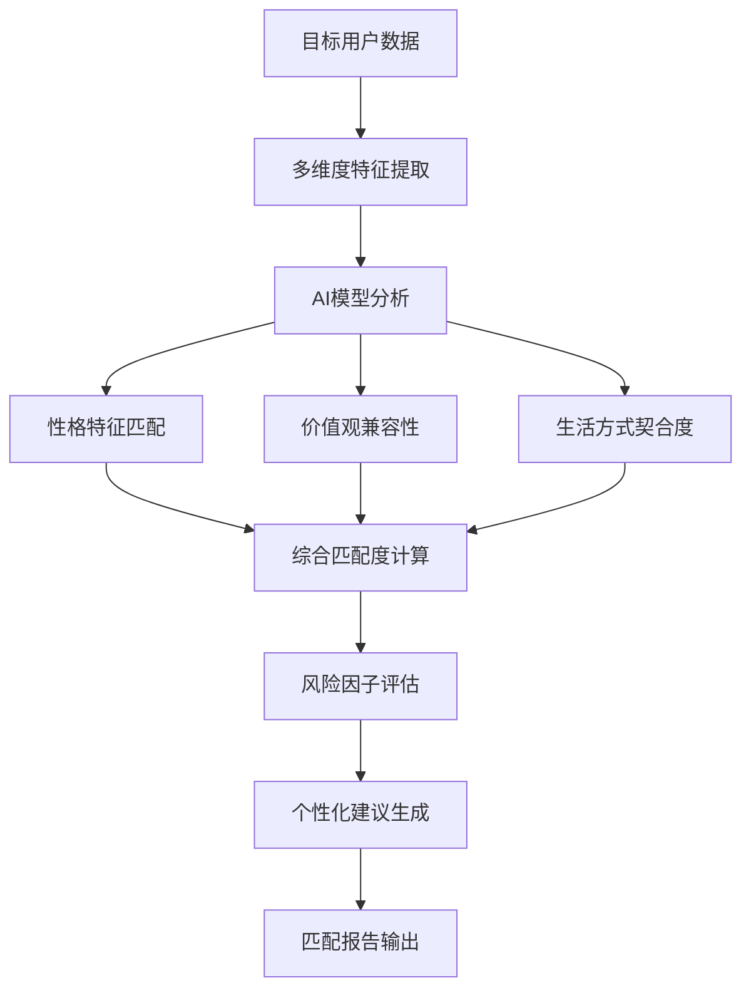
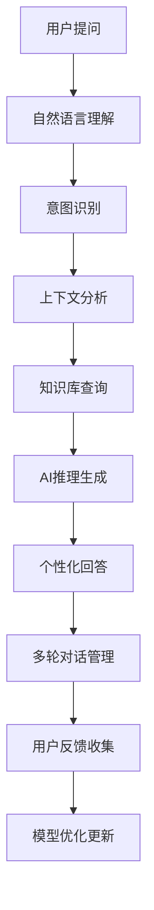
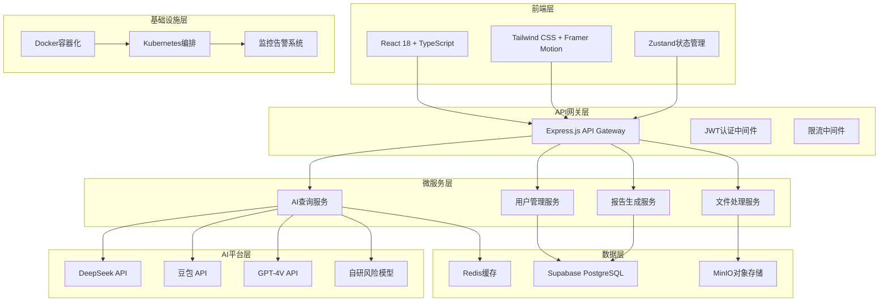

# 相亲对象背调AI - 产品需求文档

**文档版本：** v1.0  
**创建日期：** 2024年12月  
**最后更新：** 2024年12月  
**文档状态：** 正式版  

---

## 版本更新记录

| 版本 | 日期 | 更新内容 | 更新人 |
|------|------|----------|--------|
| v1.0 | 2024-12 | 初始版本，整合AI大模型查询功能与背调专家系统 | 产品团队 |

---

## 1. 产品概述

### 1.1 产品定义

《相亲对象背调AI》是一款基于多模态AI大模型的智能背景调查平台，通过整合DeepSeek、豆包等主流AI平台，为用户提供全面、准确、智能的相亲对象背景分析服务。产品采用先进的AI技术，实现多源数据融合、智能风险评估和个性化匹配建议。

### 1.2 核心价值主张

- **AI驱动的智能分析**：集成多个主流AI大模型，提供深度的人物画像分析和风险评估
- **多模态数据处理**：支持文本、图片等多种输入方式，全方位收集和分析目标信息
- **实时智能匹配**：基于AI算法提供个性化的匹配度评估和建议
- **隐私安全保障**：端到端加密，符合数据保护法规，用户可控的数据管理

### 1.3 目标用户

- **主要用户**：有相亲需求的单身人士（25-45岁）
- **次要用户**：婚恋中介机构、婚恋平台、关心子女婚恋的家长
- **企业用户**：婚恋服务机构、人力资源公司

### 1.4 市场价值

- **市场规模**：中国婚恋市场规模超过40亿元，背景调查需求持续增长
- **技术优势**：首个集成多AI模型的智能背调平台，技术领先性明显
- **商业模式**：SaaS订阅 + 按次付费，预计年收入可达千万级别

---

## 2. 核心功能架构

### 2.1 用户角色体系

| 角色类型 | 注册方式 | 核心权限 | 查询限制 | 高级功能 |
|----------|----------|----------|----------|----------|
| 免费用户 | 手机号/邮箱注册 | 基础查询功能 | 每月3次免费查询 | 基础报告查看 |
|标准用户 | 付费升级 | 完整查询功能 | 每月50次查询 | 详细报告、导出功能 |
|高级用户 | 高级套餐 | 全功能访问 | 无限查询次数 | AI对话助手、定制报告 |
| 企业用户 | 企业认证 | 批量查询管理 | 自定义配额 | API接口、数据分析 |
| 管理员 | 系统分配 | 系统管理权限 | 无限制 | 用户管理、数据监控 |

### 2.2 功能模块架构

#### 2.2.1 核心页面结构

我们的相亲对象背调AI平台包含以下主要功能页面：

1. **智能首页**：产品介绍、AI功能展示、用户引导、智能推荐
2. **用户中心**：登录注册、身份验证、套餐管理、个人设置
3. **AI查询输入页**：多模态信息输入、智能预处理、查询配置
4. **实时分析页**：AI查询进度、多平台状态、实时结果预览
5. **智能报告页**：AI分析结果、风险评估、匹配度分析、可视化展示
6. **报告管理页**：历史记录、批量管理、导出功能、分享设置
7. **AI助手页**：智能对话、个性化建议、问答互动
8. **模型配置页**：AI参数设置、平台优先级、性能监控
9. **隐私安全页**：数据管理、隐私设置、合规声明

#### 2.2.2 AI功能增强模块

1. **多模态AI引擎**
   - DeepSeek文本分析
   - 豆包图像识别
   - GPT-4V多模态理解
   - 自研风险评估模型

2. **智能匹配系统**
   - 性格特征匹配
   - 价值观兼容性分析
   - 生活方式匹配度
   - 风险因子评估

3. **实时AI对话助手**
   - 自然语言交互
   - 个性化建议生成
   - 情感分析支持
   - 多轮对话记忆

---

## 3. 详细功能规格

### 3.1 页面功能详情

| 页面名称 | 模块名称 | 功能描述 | AI增强特性 |
|----------|----------|----------|------------|
| 智能首页 | AI功能展示区 | 展示AI分析能力、成功案例、技术优势 | 智能内容推荐、个性化展示 |
| 智能首页 | 用户引导区 | 新手指导、功能介绍、快速上手 | AI驱动的个性化引导流程 |
| AI查询输入页 | 多模态输入模块 | 支持文本、图片、语音等多种输入方式 | 智能输入验证、自动信息补全 |
| AI查询输入页 | 智能预处理模块 | 图片优化、文本标准化、数据清洗 | AI驱动的质量优化和格式转换 |
| AI查询输入页 | 查询策略配置 | 搜索范围、AI模型选择、隐私级别设置 | 智能推荐最优查询策略 |
| 实时分析页 | AI查询调度器 | 多平台并行查询、智能重试、负载均衡 | 动态调度优化、故障自愈 |
| 实时分析页 | 进度可视化 | 实时进度展示、平台状态监控、预估完成时间 | AI预测分析、异常检测 |
| 实时分析页 | 缓存智能管理 | 查询结果缓存、去重处理、增量更新 | 智能缓存策略、相似度匹配 |
| 智能报告页 | AI分析引擎 | 多源数据融合、交叉验证、可信度评分 | 深度学习模型、置信度计算 |
| 智能报告页 | 风险评估模块 | 诚信度分析、风险因子识别、预警机制 | AI风险模型、动态评分 |
| 智能报告页 | 匹配度分析 | 性格匹配、价值观兼容性、生活方式契合度 | 多维度AI匹配算法 |
| 智能报告页 | 可视化展示 | 雷达图、关系图谱、时间轴、词云图 | 智能图表生成、交互式可视化 |
| 报告管理页 | 智能分类管理 | 自动分类、标签管理、搜索筛选 | AI驱动的智能分类和推荐 |
| 报告管理页 | 多格式导出 | PDF、Excel、Word、图片等格式支持 | AI优化的报告模板生成 |
| AI助手页 | 智能对话引擎 | 自然语言交互、上下文理解、多轮对话 | 大语言模型驱动的智能助手 |
| AI助手页 | 个性化建议 | 基于分析结果的个性化建议和指导 | AI生成的定制化建议方案 |
| 模型配置页 | AI模型管理 | 模型选择、参数调优、性能监控 | 自适应参数优化、A/B测试 |

### 3.2 AI核心算法

#### 3.2.1 多模态数据融合算法

```
算法名称：Multi-Modal Data Fusion Algorithm (MMDFA)
输入：文本数据T、图像数据I、结构化数据S
输出：融合特征向量F

步骤：
1. 特征提取：
   - 文本特征：使用BERT/GPT提取语义特征
   - 图像特征：使用ResNet/ViT提取视觉特征
   - 结构化特征：使用统计方法提取数值特征

2. 特征对齐：
   - 使用注意力机制对齐不同模态特征
   - 应用跨模态变换器进行特征融合

3. 权重学习：
   - 动态学习各模态的重要性权重
   - 基于任务相关性调整融合策略
```

#### 3.2.2 智能风险评估模型

```
模型名称：Intelligent Risk Assessment Model (IRAM)
输入：用户画像P、行为数据B、社交网络N
输出：风险评分R ∈ [0,100]

评估维度：
1. 诚信度评估（权重：30%）
   - 信息一致性检查
   - 历史行为分析
   - 第三方验证结果

2. 稳定性评估（权重：25%）
   - 职业稳定性
   - 关系稳定性
   - 生活规律性

3. 匹配度评估（权重：25%）
   - 价值观匹配
   - 兴趣爱好契合
   - 生活方式兼容

4. 潜在风险评估（权重：20%）
   - 不良记录检查
   - 异常行为识别
   - 社交网络分析
```

---

## 4. 核心业务流程

### 4.1 AI增强的用户查询流程



### 4.2 智能匹配分析流程



### 4.3 AI助手交互流程



---

## 5. 用户界面设计

### 5.1 设计系统规范

#### 5.1.1 视觉风格

- **主色调**：深蓝色 (#1e3a8a) - 专业可信，科技蓝 (#3b82f6) - 智能科技
- **辅助色彩**：
  - 成功绿 (#10b981) - 正面指标
  - 警告橙 (#f59e0b) - 注意事项  
  - 错误红 (#ef4444) - 风险提示
  - 中性灰 (#6b7280) - 辅助信息
- **渐变色**：蓝色渐变 (from-blue-600 to-blue-800) - 按钮和卡片
- **背景色**：白色 (#ffffff)、浅灰 (#f8fafc)、深色模式 (#1f2937)

#### 5.1.2 字体系统

- **中文字体**：思源黑体 (Source Han Sans)
- **英文字体**：Inter
- **代码字体**：JetBrains Mono
- **字体大小**：
  - 主标题：28px (font-size-2xl)
  - 副标题：24px (font-size-xl)
  - 正文：16px (font-size-base)
  - 辅助文字：14px (font-size-sm)
  - 小字：12px (font-size-xs)

#### 5.1.3 组件规范

- **按钮样式**：圆角 8px，渐变背景，悬停动画效果
- **卡片设计**：圆角 12px，阴影效果，边框 1px
- **输入框**：圆角 6px，聚焦状态边框高亮
- **图标风格**：线性图标，2px线宽，24px标准尺寸

### 5.2 页面设计详情

| 页面名称 | 模块名称 | UI元素设计 | 交互特性 |
|----------|----------|------------|----------|
| 智能首页 | Hero区域 | 大背景图+渐变遮罩，动态标题，AI功能演示 | 滚动视差效果，动画展示 |
| 智能首页 | 功能展示区 | 卡片式布局，图标+文字，悬停效果 | 鼠标悬停放大，点击展开详情 |
| AI查询输入页 | 多模态输入区 | 拖拽上传区域，实时预览，进度指示 | 拖拽交互，实时反馈 |
| AI查询输入页 | 智能配置面板 | 滑块控件，开关按钮，下拉选择 | 实时参数调整，智能推荐 |
| 实时分析页 | 进度监控面板 | 环形进度条，状态卡片，实时日志 | 动态更新，状态变化动画 |
| 实时分析页 | AI平台状态 | 平台图标，连接状态，响应时间 | 实时状态更新，异常提醒 |
| 智能报告页 | 分析结果展示 | 雷达图，仪表盘，数据卡片 | 交互式图表，数据钻取 |
| 智能报告页 | 风险评估面板 | 风险等级指示器，详细说明，建议卡片 | 分级颜色编码，展开收起 |
| AI助手页 | 对话界面 | 聊天气泡，输入框，快捷回复 | 实时打字效果，语音输入 |

### 5.3 响应式设计策略

#### 5.3.1 断点设置

- **移动端**：< 768px - 单栏布局，底部导航
- **平板端**：768px - 1024px - 两栏布局，侧边栏可折叠  
- **桌面端**：> 1024px - 三栏布局，完整功能展示
- **大屏端**：> 1440px - 宽屏优化，更多信息展示

#### 5.3.2 适配策略

- **移动端优化**：
  - 增大点击区域（最小44px）
  - 简化操作流程
  - 优化触摸手势
  - 减少信息密度

- **桌面端增强**：
  - 多窗口并行操作
  - 快捷键支持
  - 鼠标悬停效果
  - 详细信息展示

---

## 6. 技术架构方案

### 6.1 整体架构设计



### 6.2 核心技术栈

#### 6.2.1 前端技术栈

- **框架**：React 18 + TypeScript 5.0
- **构建工具**：Vite 5.0
- **样式方案**：Tailwind CSS 3.4 + PostCSS
- **状态管理**：Zustand + React Query
- **动画库**：Framer Motion
- **图表库**：Recharts + D3.js
- **UI组件**：Headless UI + Radix UI
- **表单处理**：React Hook Form + Zod

#### 6.2.2 后端技术栈

- **运行时**：Node.js 20 LTS
- **框架**：Express.js 4.18
- **语言**：TypeScript 5.0
- **数据库**：Supabase (PostgreSQL 15)
- **缓存**：Redis 7.0
- **对象存储**：MinIO / Supabase Storage
- **消息队列**：Bull Queue + Redis
- **任务调度**：node-cron

#### 6.2.3 AI集成技术

- **DeepSeek SDK**：文本分析和理解
- **豆包 API**：图像识别和处理
- **OpenAI SDK**：GPT-4V多模态分析
- **自研模型**：风险评估和匹配算法
- **向量数据库**：Pinecone / Weaviate
- **模型服务**：TensorFlow Serving

### 6.3 数据库设计

#### 6.3.1 核心数据表

```sql
-- 用户表
CREATE TABLE users (
    id UUID PRIMARY KEY DEFAULT gen_random_uuid(),
    email VARCHAR(255) UNIQUE NOT NULL,
    phone VARCHAR(20) UNIQUE,
    password_hash VARCHAR(255) NOT NULL,
    real_name VARCHAR(100),
    subscription_plan VARCHAR(20) DEFAULT 'free',
    query_count INTEGER DEFAULT 0,
    is_verified BOOLEAN DEFAULT false,
    avatar_url TEXT,
    created_at TIMESTAMP WITH TIME ZONE DEFAULT NOW(),
    updated_at TIMESTAMP WITH TIME ZONE DEFAULT NOW()
);

-- AI查询记录表
CREATE TABLE ai_queries (
    id UUID PRIMARY KEY DEFAULT gen_random_uuid(),
    user_id UUID REFERENCES users(id) ON DELETE CASCADE,
    target_name VARCHAR(100) NOT NULL,
    target_info JSONB,
    query_config JSONB,
    status VARCHAR(20) DEFAULT 'pending',
    progress INTEGER DEFAULT 0,
    created_at TIMESTAMP WITH TIME ZONE DEFAULT NOW(),
    completed_at TIMESTAMP WITH TIME ZONE,
    INDEX idx_ai_queries_user_id (user_id),
    INDEX idx_ai_queries_status (status),
    INDEX idx_ai_queries_created_at (created_at DESC)
);

-- AI平台响应表
CREATE TABLE ai_platform_responses (
    id UUID PRIMARY KEY DEFAULT gen_random_uuid(),
    query_id UUID REFERENCES ai_queries(id) ON DELETE CASCADE,
    platform VARCHAR(50) NOT NULL,
    request_data JSONB,
    response_data JSONB,
    status VARCHAR(20) DEFAULT 'pending',
    response_time INTEGER,
    error_message TEXT,
    created_at TIMESTAMP WITH TIME ZONE DEFAULT NOW(),
    INDEX idx_platform_responses_query_id (query_id),
    INDEX idx_platform_responses_platform (platform)
);

-- 查询结果表
CREATE TABLE query_results (
    id UUID PRIMARY KEY DEFAULT gen_random_uuid(),
    query_id UUID REFERENCES ai_queries(id) ON DELETE CASCADE,
    result_type VARCHAR(50) NOT NULL,
    result_data JSONB NOT NULL,
    confidence_score DECIMAL(5,4),
    source_platforms TEXT[],
    created_at TIMESTAMP WITH TIME ZONE DEFAULT NOW(),
    INDEX idx_query_results_query_id (query_id),
    INDEX idx_query_results_type (result_type)
);

-- 风险评估表
CREATE TABLE risk_assessments (
    id UUID PRIMARY KEY DEFAULT gen_random_uuid(),
    query_id UUID REFERENCES ai_queries(id) ON DELETE CASCADE,
    overall_score INTEGER NOT NULL CHECK (overall_score >= 0 AND overall_score <= 100),
    credibility_score INTEGER,
    stability_score INTEGER,
    compatibility_score INTEGER,
    risk_factors JSONB,
    recommendations JSONB,
    created_at TIMESTAMP WITH TIME ZONE DEFAULT NOW(),
    INDEX idx_risk_assessments_query_id (query_id),
    INDEX idx_risk_assessments_score (overall_score DESC)
);

-- 报告表
CREATE TABLE reports (
    id UUID PRIMARY KEY DEFAULT gen_random_uuid(),
    query_id UUID REFERENCES ai_queries(id) ON DELETE CASCADE,
    user_id UUID REFERENCES users(id) ON DELETE CASCADE,
    title VARCHAR(200) NOT NULL,
    content JSONB NOT NULL,
    template_id VARCHAR(50),
    export_formats TEXT[],
    is_shared BOOLEAN DEFAULT false,
    share_token VARCHAR(100) UNIQUE,
    created_at TIMESTAMP WITH TIME ZONE DEFAULT NOW(),
    updated_at TIMESTAMP WITH TIME ZONE DEFAULT NOW(),
    INDEX idx_reports_user_id (user_id),
    INDEX idx_reports_query_id (query_id),
    INDEX idx_reports_created_at (created_at DESC)
);

-- AI对话记录表
CREATE TABLE ai_conversations (
    id UUID PRIMARY KEY DEFAULT gen_random_uuid(),
    user_id UUID REFERENCES users(id) ON DELETE CASCADE,
    query_id UUID REFERENCES ai_queries(id) ON DELETE SET NULL,
    conversation_data JSONB NOT NULL,
    message_count INTEGER DEFAULT 0,
    last_message_at TIMESTAMP WITH TIME ZONE DEFAULT NOW(),
    created_at TIMESTAMP WITH TIME ZONE DEFAULT NOW(),
    INDEX idx_conversations_user_id (user_id),
    INDEX idx_conversations_query_id (query_id)
);
```

#### 6.3.2 权限控制

```sql
-- 基础权限设置
GRANT SELECT ON users TO anon;
GRANT ALL PRIVILEGES ON users TO authenticated;

-- AI查询权限
GRANT SELECT, INSERT, UPDATE ON ai_queries TO authenticated;
GRANT SELECT, INSERT ON ai_platform_responses TO authenticated;
GRANT SELECT, INSERT ON query_results TO authenticated;

-- 报告权限
GRANT ALL PRIVILEGES ON reports TO authenticated;
GRANT SELECT ON reports TO anon WHERE is_shared = true;

-- 行级安全策略
ALTER TABLE ai_queries ENABLE ROW LEVEL SECURITY;
CREATE POLICY "Users can only access their own queries" ON ai_queries
    FOR ALL USING (auth.uid() = user_id);

ALTER TABLE reports ENABLE ROW LEVEL SECURITY;
CREATE POLICY "Users can access their own reports or shared reports" ON reports
    FOR SELECT USING (auth.uid() = user_id OR is_shared = true);
```

---

## 7. 性能指标与技术要求

### 7.1 性能指标

#### 7.1.1 响应时间要求

- **页面加载时间**：首屏加载 ≤ 2秒，完整加载 ≤ 5秒
- **AI查询响应时间**：平均响应时间 ≤ 10秒，95%请求 ≤ 15秒
- **报告生成时间**：简单报告 ≤ 3秒，复杂报告 ≤ 8秒
- **AI助手响应时间**：文本回复 ≤ 2秒，复杂分析 ≤ 5秒

#### 7.1.2 并发性能

- **并发用户数**：支持1000+并发用户
- **查询并发数**：支持每秒50次并发查询
- **AI平台调用**：支持每秒100次API调用
- **数据库连接**：最大连接数500，连接池大小50

#### 7.1.3 可用性指标

- **系统可用性**：99.9%年度可用性保证
- **API可用性**：99.95%核心API可用性
- **数据一致性**：强一致性保证，零数据丢失
- **故障恢复时间**：平均恢复时间 ≤ 5分钟

### 7.2 安全要求

#### 7.2.1 数据安全

- **传输加密**：全站HTTPS，TLS 1.3协议
- **存储加密**：敏感数据AES-256加密存储
- **密钥管理**：使用HSM硬件安全模块
- **数据备份**：每日自动备份，异地容灾

#### 7.2.2 访问控制

- **身份认证**：JWT + Refresh Token机制
- **权限控制**：RBAC基于角色的访问控制
- **API安全**：Rate Limiting + API Key验证
- **会话管理**：安全会话管理，自动过期

#### 7.2.3 隐私保护

- **数据最小化**：仅收集必要数据
- **用户控制**：用户可控的数据删除和导出
- **匿名化处理**：敏感数据匿名化存储
- **合规性**：符合GDPR、《个人信息保护法》等法规

### 7.3 监控与运维

#### 7.3.1 系统监控

- **性能监控**：Prometheus + Grafana
- **日志管理**：ELK Stack (Elasticsearch + Logstash + Kibana)
- **错误追踪**：Sentry错误监控
- **用户行为分析**：Google Analytics + 自建埋点

#### 7.3.2 告警机制

- **实时告警**：关键指标异常实时通知
- **分级告警**：P0/P1/P2不同级别告警
- **多渠道通知**：邮件、短信、钉钉、微信
- **自动恢复**：部分故障自动恢复机制

---

## 8. 技术可行性评估

### 8.1 技术风险评估

#### 8.1.1 高风险项

| 风险项 | 风险等级 | 影响程度 | 缓解措施 |
|--------|----------|----------|----------|
| AI平台API稳定性 | 高 | 核心功能受影响 | 多平台备份、降级策略、本地缓存 |
| 大规模并发处理 | 中 | 性能瓶颈 | 微服务架构、负载均衡、缓存优化 |
| 数据隐私合规 | 高 | 法律风险 | 严格数据治理、合规审计、法务支持 |
| AI模型准确性 | 中 | 用户体验 | 多模型融合、人工审核、持续优化 |

#### 8.1.2 技术挑战

1. **多模态AI融合**
   - 挑战：不同AI平台的数据格式和质量差异
   - 解决方案：标准化数据处理管道、智能数据清洗

2. **实时性能优化**
   - 挑战：AI查询响应时间控制在10秒内
   - 解决方案：并行查询、智能缓存、结果预测

3. **数据安全与隐私**
   - 挑战：敏感个人信息的安全处理
   - 解决方案：端到端加密、数据脱敏、权限控制

### 8.2 技术选型合理性

#### 8.2.1 前端技术选型

- **React 18**：成熟稳定，生态丰富，团队熟悉度高
- **TypeScript**：类型安全，代码质量保证，开发效率提升
- **Tailwind CSS**：快速开发，一致性设计，维护成本低

#### 8.2.2 后端技术选型

- **Node.js + Express**：JavaScript全栈，开发效率高，社区支持好
- **Supabase**：快速开发，内置认证，实时功能，成本可控
- **Redis**：高性能缓存，丰富数据结构，集群支持

#### 8.2.3 AI平台选型

- **DeepSeek**：国产化，成本可控，文本分析能力强
- **豆包**：字节跳动产品，图像识别优秀，API稳定
- **GPT-4V**：多模态能力领先，分析质量高，国际标杆

### 8.3 开发资源评估

#### 8.3.1 团队配置

- **前端开发**：2-3人，React/TypeScript专家
- **后端开发**：2-3人，Node.js/数据库专家
- **AI工程师**：1-2人，机器学习/NLP专家
- **产品经理**：1人，AI产品经验
- **UI/UX设计师**：1人，B端产品设计经验
- **测试工程师**：1人，自动化测试经验
- **运维工程师**：1人，云原生架构经验

#### 8.3.2 开发周期

- **MVP版本**：3-4个月
  - 基础功能开发：2个月
  - AI集成与测试：1个月
  - 安全与性能优化：1个月

- **完整版本**：6-8个月
  - 高级功能开发：2个月
  - AI助手与智能匹配：2个月
  - 性能优化与压测：1个月
  - 上线准备与运维：1个月

#### 8.3.3 成本预估

- **开发成本**：200-300万元（包含人力、设备、软件许可）
- **AI平台成本**：每月5-10万元（基于调用量）
- **基础设施成本**：每月2-5万元（云服务、CDN、存储）
- **运营成本**：每月3-8万元（人力、营销、客服）

---

## 9. 项目实施计划

### 9.1 开发里程碑

#### 9.1.1 第一阶段：基础平台搭建（Month 1-2）

**目标**：完成基础架构和核心功能开发

**主要任务**：
- 前端框架搭建和基础组件开发
- 后端API架构设计和用户管理系统
- 数据库设计和基础数据模型
- AI平台SDK集成和测试
- 基础的查询输入和结果展示功能

**交付物**：
- 可运行的基础平台
- 用户注册登录功能
- 简单的AI查询功能
- 基础的报告展示

#### 9.1.2 第二阶段：AI功能增强（Month 3-4）

**目标**：完成AI核心功能和智能分析

**主要任务**：
- 多模态AI引擎开发
- 智能查询调度器实现
- 风险评估模型集成
- 匹配度分析算法开发
- 实时进度监控功能

**交付物**：
- 完整的AI分析功能
- 多平台并行查询
- 智能风险评估
- 可视化分析报告

#### 9.1.3 第三阶段：高级功能开发（Month 5-6）

**目标**：完成高级功能和用户体验优化

**主要任务**：
- AI对话助手开发
- 智能报告生成系统
- 多格式导出功能
- 移动端适配优化
- 性能优化和缓存策略

**交付物**：
- AI助手功能
- 完整的报告管理系统
- 响应式设计
- 性能优化版本

#### 9.1.4 第四阶段：测试与上线（Month 7-8）

**目标**：完成全面测试和生产环境部署

**主要任务**：
- 功能测试和性能测试
- 安全测试和渗透测试
- 用户体验测试和优化
- 生产环境部署和监控
- 用户培训和文档编写

**交付物**：
- 生产就绪的完整系统
- 测试报告和文档
- 运维手册和监控系统
- 用户使用指南

### 9.2 质量保证计划

#### 9.2.1 测试策略

- **单元测试**：代码覆盖率 ≥ 80%
- **集成测试**：API接口和数据库集成测试
- **端到端测试**：关键用户流程自动化测试
- **性能测试**：负载测试和压力测试
- **安全测试**：漏洞扫描和渗透测试

#### 9.2.2 代码质量

- **代码审查**：所有代码必须经过同行审查
- **静态分析**：使用ESLint、SonarQube等工具
- **持续集成**：GitHub Actions自动化构建和测试
- **版本控制**：Git Flow工作流，规范提交信息

### 9.3 风险管控

#### 9.3.1 技术风险

- **AI平台依赖**：建立多平台备份机制，开发降级策略
- **性能瓶颈**：提前进行性能测试，建立监控告警
- **数据安全**：严格的安全审计，定期安全评估

#### 9.3.2 项目风险

- **进度延期**：合理的缓冲时间，敏捷开发方法
- **需求变更**：版本控制，变更影响评估
- **团队风险**：知识分享，关键技能备份

---

## 10. 商业模式与运营策略

### 10.1 商业模式设计

#### 10.1.1 收费模式

| 套餐类型 | 月费价格 | 查询次数 | 核心功能 | 目标用户 |
|----------|----------|----------|----------|----------|
| 免费版 | ¥0 | 3次/月 | 基础查询、简单报告 | 试用用户 |
| 标准版 | ¥99 | 50次/月 | 完整查询、详细报告、导出功能 | 个人用户 |
| 高级版 | ¥299 | 无限次 | AI助手、定制报告、优先支持 | 重度用户 |
| 企业版 | ¥999 | 无限次 | API接口、批量查询、数据分析 | 企业客户 |

#### 10.1.2 增值服务

- **定制报告模板**：¥50-200/个
- **专家人工审核**：¥100-500/次
- **API调用服务**：¥0.5-2/次
- **数据导出服务**：¥20-100/次
- **优先客服支持**：¥200/月

### 10.2 市场推广策略

#### 10.2.1 目标市场

- **一线市场**：一二线城市25-40岁高收入单身人群
- **二线市场**：婚恋中介机构、婚恋平台
- **三线市场**：关心子女婚恋的中产家庭

#### 10.2.2 推广渠道

- **线上推广**：
  - 搜索引擎营销（SEM/SEO）
  - 社交媒体营销（微信、微博、小红书）
  - 内容营销（知乎、B站、公众号）
  - 合作推广（婚恋平台、相亲网站）

- **线下推广**：
  - 婚恋展会参展
  - 中介机构合作
  - KOL意见领袖合作
  - 媒体公关活动

### 10.3 运营指标

#### 10.3.1 关键指标

- **用户指标**：
  - 月活跃用户数（MAU）
  - 用户留存率（次日、7日、30日）
  - 用户生命周期价值（LTV）
  - 获客成本（CAC）

- **业务指标**：
  - 月度经常性收入（MRR）
  - 付费转化率
  - 客单价（ARPU）
  - 查询成功率

- **产品指标**：
  - 查询完成时间
  - 用户满意度评分
  - 功能使用率
  - 错误率和可用性

#### 10.3.2 增长目标

- **第一年目标**：
  - 注册用户：10万+
  - 付费用户：5000+
  - 月收入：50万+
  - 查询成功率：95%+

- **第二年目标**：
  - 注册用户：50万+
  - 付费用户：2万+
  - 月收入：200万+
  - 市场占有率：行业前三

---

## 11. 总结与展望

### 11.1 项目总结

《相亲对象背调AI》产品通过深度整合AI大模型查询功能与背调专家系统，创造了一个全新的智能背景调查平台。该产品具有以下核心优势：

1. **技术领先性**：集成多个主流AI平台，实现多模态数据分析
2. **功能完整性**：覆盖从信息输入到报告生成的完整流程
3. **用户体验优秀**：智能化操作，可视化展示，响应式设计
4. **商业价值明确**：解决真实市场需求，具有良好的商业前景
5. **技术可行性高**：基于成熟技术栈，风险可控

### 11.2 创新亮点

1. **多模态AI融合**：首次将文本、图像、结构化数据进行深度融合分析
2. **智能风险评估**：基于AI的多维度风险评估模型
3. **实时AI助手**：提供个性化的智能对话和建议服务
4. **隐私保护设计**：端到端加密，用户可控的数据管理
5. **智能匹配算法**：基于深度学习的个性化匹配推荐

### 11.3 未来发展方向

#### 11.3.1 短期规划（6-12个月）

- **功能增强**：增加更多AI平台支持，提升分析准确性
- **用户体验优化**：基于用户反馈持续优化界面和流程
- **性能提升**：优化查询速度，提高系统并发能力
- **市场拓展**：扩大用户基数，提高品牌知名度

#### 11.3.2 中期规划（1-2年）

- **AI能力升级**：开发自研AI模型，提升核心竞争力
- **平台化发展**：开放API接口，构建生态合作伙伴
- **国际化扩展**：支持多语言，拓展海外市场
- **移动端应用**：开发iOS/Android原生应用

#### 11.3.3 长期愿景（3-5年）

- **行业标准制定**：成为智能背调行业的标准制定者
- **生态系统构建**：打造完整的婚恋服务生态链
- **技术输出**：向其他行业输出AI背调技术
- **IPO准备**：准备公开上市，成为行业独角兽

### 11.4 成功关键因素

1. **技术创新**：持续的AI技术研发和创新能力
2. **数据安全**：严格的数据保护和隐私合规
3. **用户体验**：优秀的产品设计和用户体验
4. **市场推广**：有效的市场营销和品牌建设
5. **团队建设**：优秀的技术和运营团队
6. **资金支持**：充足的资金保障产品发展
7. **合规运营**：严格遵守相关法律法规

通过以上全面的产品需求文档，《相亲对象背调AI》项目具备了清晰的发展路径和实施方案。在技术可行性、商业价值、用户需求等方面都有充分的论证和规划，为项目的成功实施奠定了坚实的基础。

---

**文档结束**

*本文档为《相亲对象背调AI》产品的完整需求规格说明，包含了产品定义、功能架构、技术方案、实施计划等全方位内容。文档将作为产品开发、测试、运营的重要参考依据。*