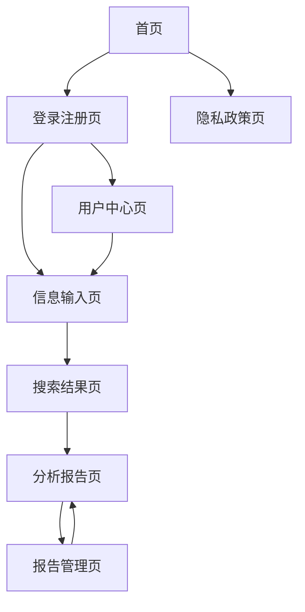

# 相亲对象背调专家 - 产品需求文档

## 1. Product Overview

《相亲对象背调专家》是一款基于AI技术的智能背景调查网页应用，通过整合互联网公开信息，为用户提供相亲对象的全面背景分析报告。

- 主要目的：帮助用户在相亲过程中更好地了解对方，降低交往风险，提高匹配成功率
- 目标用户：有相亲需求的单身人士、婚恋中介机构、家长等关心子女婚恋的群体
- 市场价值：填补个人背景调查市场空白，为现代婚恋提供科技化解决方案

## 2. Core Features

### 2.1 User Roles

| Role | Registration Method | Core Permissions |
|------|---------------------|------------------|
| 普通用户 | 手机号/邮箱注册 | 基础查询功能，每月3次免费查询 |
| 高级用户 | 付费升级 | 无限查询次数，高级分析报告，数据导出功能 |
| 管理员 | 内部邀请 | 系统管理，用户管理，数据审核 |

### 2.2 Feature Module

我们的相亲对象背调专家应用包含以下主要页面：

1. **首页**：产品介绍、功能展示、用户注册入口
2. **登录注册页**：用户身份验证、账户创建
3. **信息输入页**：目标人物基本信息录入、照片上传
4. **搜索结果页**：数据采集进度展示、初步结果预览
5. **分析报告页**：详细的人物画像分析、可视化图表展示
6. **报告管理页**：历史查询记录、报告下载、数据管理
7. **用户中心页**：个人设置、套餐管理、隐私设置
8. **隐私政策页**：数据使用说明、用户权利声明

### 2.3 Page Details

| Page Name | Module Name | Feature description |
|-----------|-------------|---------------------|
| 首页 | 产品介绍区 | 展示产品核心价值、功能亮点、用户评价 |
| 首页 | 功能演示区 | 交互式功能演示、使用流程说明 |
| 首页 | 注册引导区 | 快速注册入口、套餐选择引导 |
| 登录注册页 | 身份验证模块 | 手机号/邮箱登录、短信验证、密码重置 |
| 登录注册页 | 账户创建模块 | 新用户注册、实名认证、协议确认 |
| 信息输入页 | 基本信息录入 | 姓名输入（中英文支持）、年龄、职业、教育背景 |
| 信息输入页 | 照片上传模块 | 支持JPG/PNG格式，最大10MB，人脸识别预处理 |
| 信息输入页 | 搜索配置 | 搜索范围设置、数据源选择、隐私级别配置 |
| 搜索结果页 | 进度监控 | 实时显示数据采集进度、已搜索平台状态 |
| 搜索结果页 | 初步结果 | 找到的社交账号预览、可信度初评 |
| 分析报告页 | 人物画像展示 | 综合评分、性格特征、兴趣爱好分析 |
| 分析报告页 | 社交网络分析 | 人际关系图谱、社交活跃度、影响力评估 |
| 分析报告页 | 风险评估 | 诚信度指标、价值观匹配、潜在风险提示 |
| 分析报告页 | 数据可视化 | 图表展示、时间轴分析、关键词云 |
| 报告管理页 | 历史记录 | 查询历史列表、报告状态管理 |
| 报告管理页 | 导出功能 | PDF/图片格式导出、自定义报告模板 |
| 报告管理页 | 数据管理 | 数据删除、隐私设置、分享权限 |
| 用户中心页 | 个人设置 | 基本信息修改、密码更改、通知设置 |
| 用户中心页 | 套餐管理 | 当前套餐状态、升级选项、使用统计 |
| 隐私政策页 | 政策说明 | 数据收集范围、使用目的、存储期限 |
| 隐私政策页 | 用户权利 | 数据访问权、修改权、删除权说明 |

## 3. Core Process

### 普通用户流程
1. 用户访问首页了解产品功能
2. 注册账户并完成实名认证
3. 在信息输入页录入目标人物信息
4. 系统开始自动搜索和数据采集
5. 用户在搜索结果页查看进度和初步结果
6. 系统完成AI分析后生成详细报告
7. 用户在分析报告页查看完整分析结果
8. 可选择导出报告或保存到历史记录

### 管理员流程
1. 管理员登录后台管理系统
2. 监控系统运行状态和数据质量
3. 审核用户举报和争议内容
4. 管理用户账户和权限设置
5. 更新数据源和分析算法

## 4. User Interface Design

### 4.1 Design Style

- **主色调**：深蓝色(#1E3A8A)代表专业可信，辅助色为浅蓝色(#3B82F6)
- **次要色彩**：警告橙色(#F59E0B)用于风险提示，成功绿色(#10B981)用于正面指标
- **按钮样式**：圆角矩形设计，主按钮采用渐变效果，悬停时有微动画
- **字体设计**：中文使用思源黑体，英文使用Inter，标题18-24px，正文14-16px
- **布局风格**：卡片式设计，顶部导航栏，左侧功能菜单，响应式网格布局
- **图标风格**：线性图标风格，统一2px线宽，配合品牌色彩

### 4.2 Page Design Overview

| Page Name | Module Name | UI Elements |
|-----------|-------------|-------------|
| 首页 | 产品介绍区 | 大背景图片，渐变遮罩，白色大标题，蓝色CTA按钮，卡片式功能展示 |
| 首页 | 功能演示区 | 交互式步骤指示器，动画演示区域，进度条样式，浅灰背景 |
| 信息输入页 | 基本信息录入 | 表单卡片布局，输入框圆角设计，标签浮动效果，验证提示红色 |
| 信息输入页 | 照片上传模块 | 拖拽上传区域，虚线边框，上传进度条，缩略图预览网格 |
| 搜索结果页 | 进度监控 | 环形进度条，平台图标展示，实时状态更新，加载动画 |
| 分析报告页 | 人物画像展示 | 雷达图可视化，评分仪表盘，标签云展示，渐变背景卡片 |
| 分析报告页 | 社交网络分析 | 力导向图网络图谱，节点大小表示影响力，连线表示关系强度 |
| 分析报告页 | 风险评估 | 红绿灯颜色编码，风险等级条形图，警告图标，详细说明折叠面板 |

### 4.3 Responsiveness

产品采用移动优先的响应式设计策略：
- **桌面端**：1200px以上使用三栏布局，充分利用屏幕空间
- **平板端**：768-1199px采用两栏布局，侧边栏可折叠
- **移动端**：768px以下使用单栏布局，底部导航栏，支持触摸手势
- **交互优化**：移动端增大点击区域，优化表单输入体验，支持滑动操作