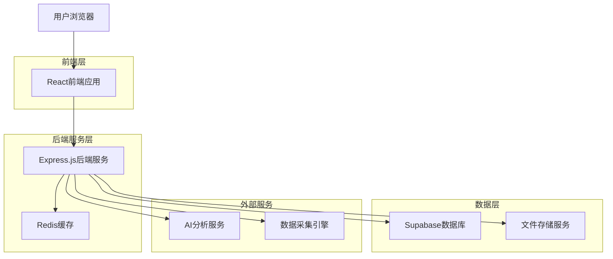
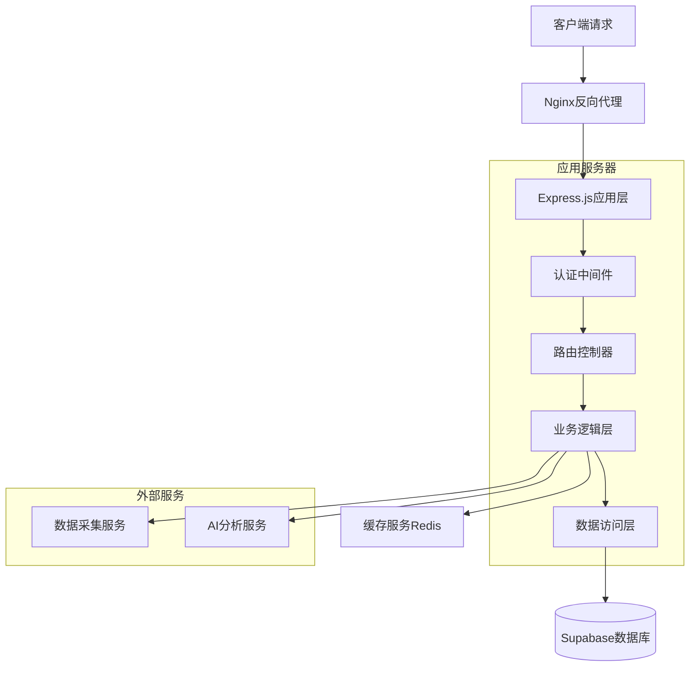
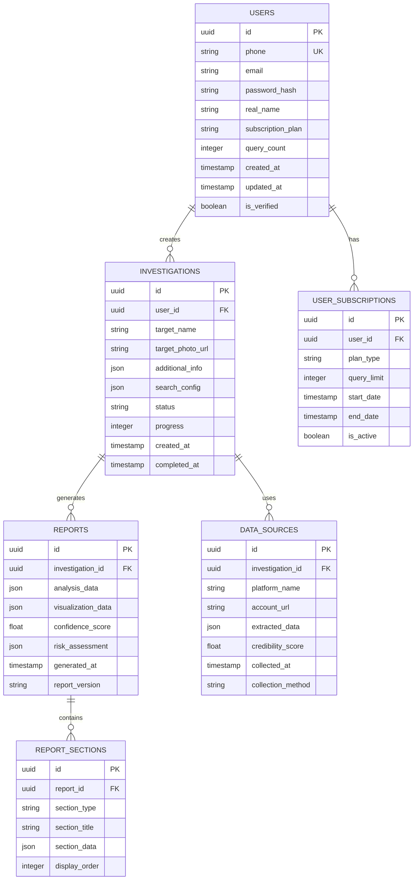

# 相亲对象背调专家 - 技术架构文档

## 1. Architecture design



## 2. Technology Description

- **前端**: React@18 + TypeScript + Tailwind CSS + Vite + React Router + Recharts
- **后端**: Express.js@4 + TypeScript + JWT认证 + Multer文件上传
- **数据库**: Supabase (PostgreSQL) + Redis缓存
- **AI服务**: OpenAI GPT-4 API + 自然语言处理库
- **数据采集**: Puppeteer + Cheerio + 社交媒体API
- **文件存储**: Supabase Storage
- **部署**: Docker + Nginx + PM2

## 3. Route definitions

| Route | Purpose |
|-------|---------|
| / | 首页，产品介绍和功能展示 |
| /login | 登录页面，用户身份验证 |
| /register | 注册页面，新用户账户创建 |
| /dashboard | 用户仪表板，查询历史和统计 |
| /search | 信息输入页面，开始新的背调查询 |
| /search/:id | 搜索结果页面，显示采集进度和初步结果 |
| /report/:id | 分析报告页面，详细的背调分析结果 |
| /reports | 报告管理页面，历史报告列表和管理 |
| /profile | 用户中心，个人设置和套餐管理 |
| /privacy | 隐私政策页面，数据使用说明 |
| /admin | 管理员后台，系统管理和用户管理 |

## 4. API definitions

### 4.1 Core API

**用户认证相关**

```
POST /api/auth/register
```

Request:
| Param Name | Param Type | isRequired | Description |
|------------|------------|------------|-------------|
| phone | string | true | 手机号码 |
| password | string | true | 密码 |
| verificationCode | string | true | 短信验证码 |
| realName | string | true | 真实姓名 |

Response:
| Param Name | Param Type | Description |
|------------|------------|-------------|
| success | boolean | 注册是否成功 |
| token | string | JWT认证令牌 |
| user | object | 用户基本信息 |

```
POST /api/auth/login
```

Request:
| Param Name | Param Type | isRequired | Description |
|------------|------------|------------|-------------|
| phone | string | true | 手机号码 |
| password | string | true | 密码 |

Response:
| Param Name | Param Type | Description |
|------------|------------|-------------|
| success | boolean | 登录是否成功 |
| token | string | JWT认证令牌 |
| user | object | 用户信息 |

**背调查询相关**

```
POST /api/investigation/create
```

Request:
| Param Name | Param Type | isRequired | Description |
|------------|------------|------------|-------------|
| targetName | string | true | 目标人物姓名 |
| targetPhoto | file | false | 目标人物照片 |
| additionalInfo | object | false | 附加信息（年龄、职业等） |
| searchScope | array | true | 搜索范围配置 |

Response:
| Param Name | Param Type | Description |
|------------|------------|-------------|
| success | boolean | 创建是否成功 |
| investigationId | string | 调查任务ID |
| estimatedTime | number | 预估完成时间（分钟） |

```
GET /api/investigation/:id/status
```

Response:
| Param Name | Param Type | Description |
|------------|------------|-------------|
| status | string | 任务状态（pending/processing/completed/failed） |
| progress | number | 完成进度（0-100） |
| currentStep | string | 当前执行步骤 |
| foundAccounts | array | 已发现的社交账号 |

```
GET /api/investigation/:id/report
```

Response:
| Param Name | Param Type | Description |
|------------|------------|-------------|
| reportData | object | 完整的分析报告数据 |
| generatedAt | string | 报告生成时间 |
| dataSource | array | 数据来源列表 |
| confidenceScore | number | 整体可信度评分 |

**报告管理相关**

```
GET /api/reports
```

Response:
| Param Name | Param Type | Description |
|------------|------------|-------------|
| reports | array | 用户的历史报告列表 |
| totalCount | number | 报告总数 |
| pagination | object | 分页信息 |

```
POST /api/reports/:id/export
```

Request:
| Param Name | Param Type | isRequired | Description |
|------------|------------|------------|-------------|
| format | string | true | 导出格式（pdf/png） |
| template | string | false | 报告模板 |

Response:
| Param Name | Param Type | Description |
|------------|------------|-------------|
| downloadUrl | string | 文件下载链接 |
| expiresAt | string | 链接过期时间 |

## 5. Server architecture diagram



## 6. Data model

### 6.1 Data model definition



### 6.2 Data Definition Language

**用户表 (users)**
```sql
-- 创建用户表
CREATE TABLE users (
    id UUID PRIMARY KEY DEFAULT gen_random_uuid(),
    phone VARCHAR(20) UNIQUE NOT NULL,
    email VARCHAR(255),
    password_hash VARCHAR(255) NOT NULL,
    real_name VARCHAR(100) NOT NULL,
    subscription_plan VARCHAR(20) DEFAULT 'basic' CHECK (subscription_plan IN ('basic', 'premium', 'enterprise')),
    query_count INTEGER DEFAULT 0,
    created_at TIMESTAMP WITH TIME ZONE DEFAULT NOW(),
    updated_at TIMESTAMP WITH TIME ZONE DEFAULT NOW(),
    is_verified BOOLEAN DEFAULT FALSE
);

-- 创建索引
CREATE INDEX idx_users_phone ON users(phone);
CREATE INDEX idx_users_subscription ON users(subscription_plan);
```

**调查任务表 (investigations)**
```sql
-- 创建调查任务表
CREATE TABLE investigations (
    id UUID PRIMARY KEY DEFAULT gen_random_uuid(),
    user_id UUID NOT NULL REFERENCES users(id) ON DELETE CASCADE,
    target_name VARCHAR(200) NOT NULL,
    target_photo_url TEXT,
    additional_info JSONB DEFAULT '{}',
    search_config JSONB DEFAULT '{}',
    status VARCHAR(20) DEFAULT 'pending' CHECK (status IN ('pending', 'processing', 'completed', 'failed')),
    progress INTEGER DEFAULT 0 CHECK (progress >= 0 AND progress <= 100),
    created_at TIMESTAMP WITH TIME ZONE DEFAULT NOW(),
    completed_at TIMESTAMP WITH TIME ZONE
);

-- 创建索引
CREATE INDEX idx_investigations_user_id ON investigations(user_id);
CREATE INDEX idx_investigations_status ON investigations(status);
CREATE INDEX idx_investigations_created_at ON investigations(created_at DESC);
```

**分析报告表 (reports)**
```sql
-- 创建分析报告表
CREATE TABLE reports (
    id UUID PRIMARY KEY DEFAULT gen_random_uuid(),
    investigation_id UUID NOT NULL REFERENCES investigations(id) ON DELETE CASCADE,
    analysis_data JSONB NOT NULL DEFAULT '{}',
    visualization_data JSONB DEFAULT '{}',
    confidence_score FLOAT CHECK (confidence_score >= 0 AND confidence_score <= 1),
    risk_assessment JSONB DEFAULT '{}',
    generated_at TIMESTAMP WITH TIME ZONE DEFAULT NOW(),
    report_version VARCHAR(10) DEFAULT '1.0'
);

-- 创建索引
CREATE INDEX idx_reports_investigation_id ON reports(investigation_id);
CREATE INDEX idx_reports_generated_at ON reports(generated_at DESC);
```

**数据源表 (data_sources)**
```sql
-- 创建数据源表
CREATE TABLE data_sources (
    id UUID PRIMARY KEY DEFAULT gen_random_uuid(),
    investigation_id UUID NOT NULL REFERENCES investigations(id) ON DELETE CASCADE,
    platform_name VARCHAR(100) NOT NULL,
    account_url TEXT,
    extracted_data JSONB DEFAULT '{}',
    credibility_score FLOAT CHECK (credibility_score >= 0 AND credibility_score <= 1),
    collected_at TIMESTAMP WITH TIME ZONE DEFAULT NOW(),
    collection_method VARCHAR(50) DEFAULT 'automated'
);

-- 创建索引
CREATE INDEX idx_data_sources_investigation_id ON data_sources(investigation_id);
CREATE INDEX idx_data_sources_platform ON data_sources(platform_name);
```

**权限设置**
```sql
-- 为匿名用户授予基本读取权限
GRANT SELECT ON users TO anon;
GRANT SELECT ON investigations TO anon;

-- 为认证用户授予完整权限
GRANT ALL PRIVILEGES ON users TO authenticated;
GRANT ALL PRIVILEGES ON investigations TO authenticated;
GRANT ALL PRIVILEGES ON reports TO authenticated;
GRANT ALL PRIVILEGES ON data_sources TO authenticated;
GRANT ALL PRIVILEGES ON report_sections TO authenticated;
GRANT ALL PRIVILEGES ON user_subscriptions TO authenticated;
```

**初始化数据**
```sql
-- 插入默认套餐配置
INSERT INTO user_subscriptions (user_id, plan_type, query_limit, start_date, end_date, is_active)
VALUES 
    ('00000000-0000-0000-0000-000000000000', 'basic', 3, NOW(), NOW() + INTERVAL '1 month', true),
    ('00000000-0000-0000-0000-000000000001', 'premium', 50, NOW(), NOW() + INTERVAL '1 month', true);
```