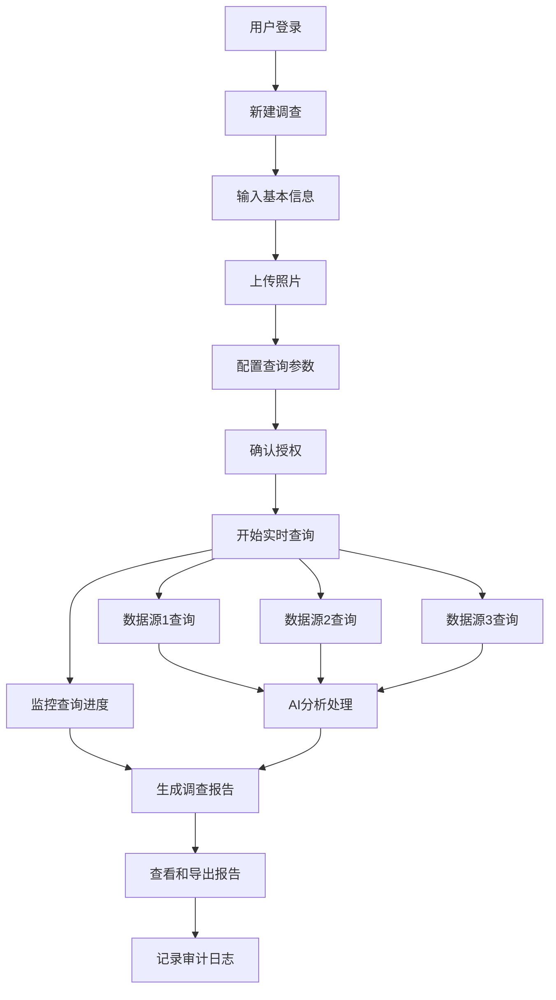

# 真实背景调查报告生成系统 - 产品需求文档

## 1. 产品概述

真实背景调查报告生成系统是一个专业的背景调查平台，通过集成多个权威数据源和AI技术，为用户提供全面、准确、合规的个人背景调查服务。系统支持实时查询、智能分析和专业报告生成，主要服务于企业HR、金融机构、法律事务所等需要进行背景核查的专业机构。

- 解决传统背景调查耗时长、准确性低、数据分散的问题，为专业机构提供高效、可靠的背景调查解决方案。
- 目标市场价值：服务于企业招聘、金融风控、法律尽调等万亿级市场，提升背景调查的效率和准确性。

## 2. 核心功能

### 2.1 用户角色

| 角色 | 注册方式 | 核心权限 |
|------|----------|----------|
| 企业用户 | 企业认证注册 | 可进行背景调查、查看详细报告、批量查询、API调用 |
| 个人用户 | 邮箱注册 | 可进行基础背景调查、查看简化报告、有查询次数限制 |
| 管理员 | 内部分配 | 系统管理、用户管理、数据源配置、合规监控 |

### 2.2 功能模块

我们的真实背景调查系统包含以下核心页面：

1. **调查发起页面**：被调查人信息输入、照片上传、调查参数配置
2. **实时查询页面**：查询进度展示、数据源状态监控、实时结果预览
3. **报告生成页面**：完整报告展示、数据可视化、导出功能
4. **报告管理页面**：历史报告查看、批量操作、统计分析
5. **数据源管理页面**：API配置、数据源状态、查询统计
6. **合规监控页面**：隐私合规检查、审计日志、风险预警

### 2.3 页面详情

| 页面名称 | 模块名称 | 功能描述 |
|----------|----------|----------|
| 调查发起页面 | 信息输入模块 | 输入被调查人完整姓名、身份证号、手机号等基本信息 |
| 调查发起页面 | 照片上传模块 | 支持JPG/PNG格式照片上传，最大5MB，自动人脸识别和质量检测 |
| 调查发起页面 | 查询配置模块 | 选择查询深度、数据源范围、报告格式等参数 |
| 实时查询页面 | 进度监控模块 | 实时显示各数据源查询进度、预计完成时间、当前查询状态 |
| 实时查询页面 | 结果预览模块 | 展示已获取的关键信息、风险提示、数据质量评估 |
| 报告生成页面 | 基本信息核实 | 显示姓名、身份证、手机号等基本信息的核实结果和匹配度 |
| 报告生成页面 | 教育背景验证 | 展示学历信息、毕业院校、专业、学位等教育背景核查结果 |
| 报告生成页面 | 工作经历核查 | 显示工作单位、职位、工作时间、薪资水平等职业信息验证 |
| 报告生成页面 | 信用记录分析 | 展示征信报告、贷款记录、信用评分、逾期情况等金融信息 |
| 报告生成页面 | 社交媒体分析 | 分析社交平台活跃度、内容倾向、人际关系网络等数字足迹 |
| 报告生成页面 | 风险评估模块 | 综合风险评分、风险因素分析、建议措施等智能评估结果 |
| 报告生成页面 | 导出功能模块 | 支持PDF、HTML、Excel等多种格式导出，包含水印和时间戳 |
| 报告管理页面 | 报告列表模块 | 显示历史报告、搜索筛选、批量操作、状态管理 |
| 报告管理页面 | 统计分析模块 | 查询统计、成功率分析、费用统计、趋势图表 |
| 数据源管理页面 | API配置模块 | 配置各数据源API密钥、调用频率、优先级设置 |
| 数据源管理页面 | 状态监控模块 | 监控数据源可用性、响应时间、错误率、配额使用情况 |
| 合规监控页面 | 隐私合规模块 | 检查查询合规性、敏感信息脱敏、用户授权验证 |
| 合规监控页面 | 审计日志模块 | 记录所有查询操作、用户行为、数据访问日志 |

## 3. 核心流程

### 企业用户调查流程
1. 用户登录系统并选择"新建调查"
2. 输入被调查人基本信息（姓名、身份证号等）
3. 上传被调查人清晰照片并通过质量检测
4. 配置调查参数（查询深度、数据源选择、报告格式）
5. 确认查询授权和合规声明
6. 系统开始实时查询各数据源
7. 用户可在查询页面监控进度和预览结果
8. 查询完成后生成完整背景调查报告
9. 用户查看报告并选择导出格式
10. 系统记录查询日志并进行合规检查

### 管理员监控流程
1. 管理员登录后台管理系统
2. 监控系统整体运行状态和数据源健康度
3. 查看用户查询统计和异常报告
4. 进行合规性检查和风险评估
5. 处理用户反馈和数据质量问题
6. 更新数据源配置和API设置

## 4. 用户界面设计

### 4.1 设计风格

- **主色调**：专业蓝色 (#1E40AF) 和深灰色 (#374151)，体现专业性和可信度
- **辅助色**：成功绿色 (#10B981)、警告橙色 (#F59E0B)、危险红色 (#EF4444)
- **按钮风格**：现代扁平化设计，圆角矩形，悬停效果明显
- **字体**：主要使用 Inter 字体，中文使用思源黑体，确保清晰易读
- **布局风格**：卡片式布局，左侧导航栏，顶部面包屑导航
- **图标风格**：使用 Lucide React 图标库，线性风格，保持一致性

### 4.2 页面设计概览

| 页面名称 | 模块名称 | UI元素 |
|----------|----------|--------|
| 调查发起页面 | 信息输入模块 | 多步骤表单，实时验证，进度指示器，输入提示和错误提醒 |
| 调查发起页面 | 照片上传模块 | 拖拽上传区域，图片预览，质量检测结果，人脸识别框标注 |
| 实时查询页面 | 进度监控模块 | 实时进度条，数据源状态卡片，预计完成时间，查询日志滚动显示 |
| 报告生成页面 | 数据展示模块 | 分栏布局，数据可视化图表，风险等级色彩编码，交互式数据表格 |
| 报告管理页面 | 列表管理模块 | 表格视图，搜索筛选器，批量操作按钮，状态标签，分页控件 |
| 数据源管理页面 | 配置界面 | 配置表单，状态指示灯，实时监控图表，API测试按钮 |

### 4.3 响应式设计

系统采用桌面优先的响应式设计，支持1920px、1366px、768px等主流分辨率。在移动端提供简化的查询和报告查看功能，确保核心业务流程在各种设备上都能正常使用。

## 5. 技术要求

### 5.1 性能要求
- 报告生成时间：≤30秒
- 系统响应时间：≤2秒
- 并发用户支持：≥1000
- 数据准确率：≥95%

### 5.2 安全要求
- 数据传输加密：TLS 1.3
- 数据存储加密：AES-256
- 用户认证：多因子认证
- 访问控制：基于角色的权限管理

### 5.3 合规要求
- 符合GDPR、CCPA等数据保护法规
- 实施数据最小化原则
- 提供用户数据删除功能
- 建立完整的审计追踪机制