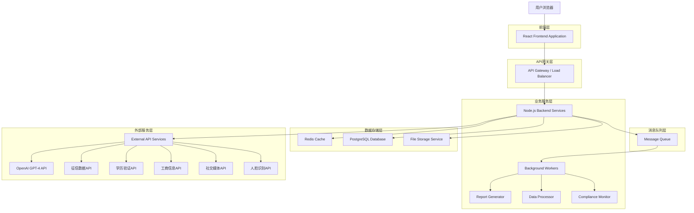
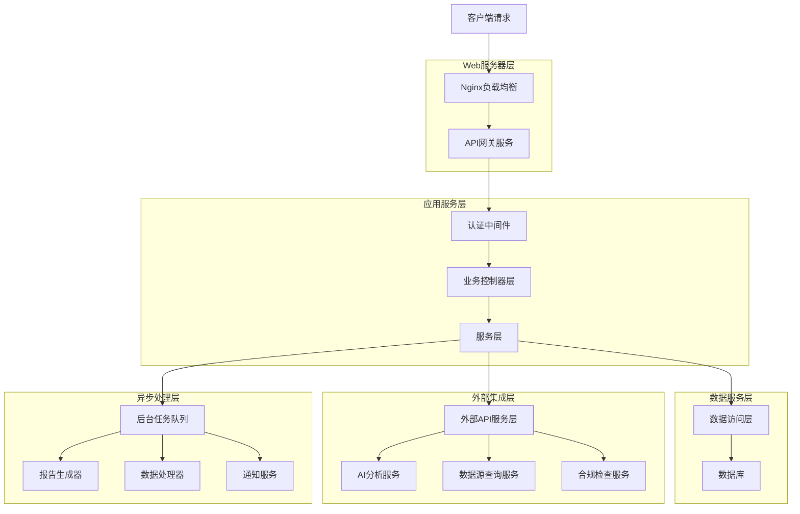
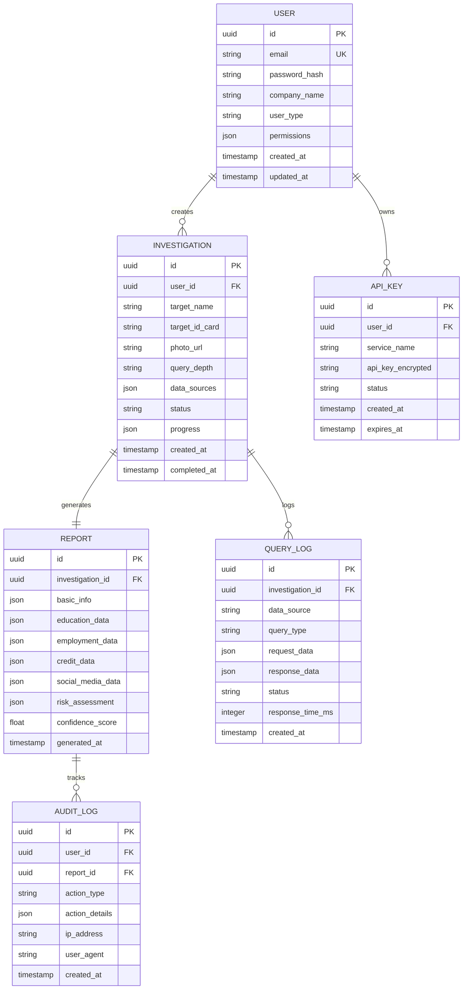

# 真实背景调查报告生成系统 - 技术架构文档

## 1. 架构设计



## 2. 技术描述

- **前端**: React@18 + TypeScript + Tailwind CSS + Vite + React Query
- **后端**: Node.js@20 + Express@4 + TypeScript + Prisma ORM
- **数据库**: PostgreSQL@15 (主数据库) + Redis@7 (缓存)
- **文件存储**: AWS S3 / 阿里云OSS
- **消息队列**: Redis Bull Queue
- **API网关**: Nginx + PM2
- **监控**: Winston + Prometheus + Grafana
- **部署**: Docker + Kubernetes / Vercel + Railway

## 3. 路由定义

| 路由 | 用途 |
|------|------|
| / | 首页，展示系统介绍和快速开始 |
| /login | 登录页面，支持多种认证方式 |
| /register | 注册页面，企业和个人用户注册 |
| /dashboard | 用户仪表板，显示统计信息和快捷操作 |
| /investigation/new | 新建调查页面，输入被调查人信息 |
| /investigation/:id | 调查详情页面，显示查询进度和结果 |
| /report/:id | 报告详情页面，完整报告展示和导出 |
| /reports | 报告管理页面，历史报告列表和批量操作 |
| /datasources | 数据源管理页面，API配置和状态监控 |
| /compliance | 合规监控页面，审计日志和风险预警 |
| /profile | 用户资料页面，账户设置和权限管理 |
| /admin | 管理员后台，系统管理和用户管理 |

## 4. API定义

### 4.1 核心API

#### 用户认证相关
```
POST /api/auth/login
```

请求:
| 参数名 | 参数类型 | 是否必需 | 描述 |
|--------|----------|----------|------|
| email | string | true | 用户邮箱 |
| password | string | true | 用户密码 |
| mfaCode | string | false | 多因子认证码 |

响应:
| 参数名 | 参数类型 | 描述 |
|--------|----------|------|
| success | boolean | 登录是否成功 |
| token | string | JWT访问令牌 |
| user | object | 用户信息 |

示例:
```json
{
  "email": "user@company.com",
  "password": "securePassword123",
  "mfaCode": "123456"
}
```

#### 调查管理相关
```
POST /api/investigations
```

请求:
| 参数名 | 参数类型 | 是否必需 | 描述 |
|--------|----------|----------|------|
| targetName | string | true | 被调查人姓名 |
| targetIdCard | string | true | 身份证号码 |
| targetPhoto | file | true | 被调查人照片 |
| queryDepth | string | false | 查询深度 (basic/standard/deep) |
| dataSources | array | false | 指定数据源列表 |

响应:
| 参数名 | 参数类型 | 描述 |
|--------|----------|------|
| investigationId | string | 调查任务ID |
| status | string | 任务状态 |
| estimatedTime | number | 预计完成时间(秒) |

#### 报告生成相关
```
GET /api/reports/:id
```

响应:
| 参数名 | 参数类型 | 描述 |
|--------|----------|------|
| reportId | string | 报告ID |
| investigationId | string | 关联调查ID |
| basicInfo | object | 基本信息核实结果 |
| education | object | 教育背景验证结果 |
| employment | object | 工作经历核查结果 |
| creditRecord | object | 信用记录分析结果 |
| socialMedia | object | 社交媒体分析结果 |
| riskAssessment | object | 风险评估结果 |
| confidenceScore | number | 报告可信度评分 |
| generatedAt | string | 报告生成时间 |

### 4.2 外部API集成

#### OpenAI GPT-4 API
```
POST /api/external/openai/analyze
```

用于智能分析和风险评估，处理非结构化数据。

#### 征信数据API
```
POST /api/external/credit/query
```

查询个人征信记录，需要用户授权。

#### 学历验证API
```
POST /api/external/education/verify
```

验证教育背景真实性。

#### 工商信息API
```
POST /api/external/business/query
```

查询企业工商信息和任职记录。

## 5. 服务器架构图



## 6. 数据模型

### 6.1 数据模型定义



### 6.2 数据定义语言

#### 用户表 (users)
```sql
-- 创建用户表
CREATE TABLE users (
    id UUID PRIMARY KEY DEFAULT gen_random_uuid(),
    email VARCHAR(255) UNIQUE NOT NULL,
    password_hash VARCHAR(255) NOT NULL,
    company_name VARCHAR(255),
    user_type VARCHAR(50) DEFAULT 'individual' CHECK (user_type IN ('individual', 'enterprise', 'admin')),
    permissions JSONB DEFAULT '{}',
    is_verified BOOLEAN DEFAULT false,
    subscription_plan VARCHAR(50) DEFAULT 'basic',
    query_quota INTEGER DEFAULT 10,
    created_at TIMESTAMP WITH TIME ZONE DEFAULT NOW(),
    updated_at TIMESTAMP WITH TIME ZONE DEFAULT NOW()
);

-- 创建索引
CREATE INDEX idx_users_email ON users(email);
CREATE INDEX idx_users_user_type ON users(user_type);
CREATE INDEX idx_users_created_at ON users(created_at DESC);
```

#### 调查表 (investigations)
```sql
-- 创建调查表
CREATE TABLE investigations (
    id UUID PRIMARY KEY DEFAULT gen_random_uuid(),
    user_id UUID NOT NULL REFERENCES users(id) ON DELETE CASCADE,
    target_name VARCHAR(255) NOT NULL,
    target_id_card VARCHAR(50),
    target_phone VARCHAR(50),
    photo_url TEXT,
    query_depth VARCHAR(20) DEFAULT 'standard' CHECK (query_depth IN ('basic', 'standard', 'deep')),
    data_sources JSONB DEFAULT '[]',
    status VARCHAR(20) DEFAULT 'pending' CHECK (status IN ('pending', 'processing', 'completed', 'failed')),
    progress JSONB DEFAULT '{"stage": "initializing", "percentage": 0}',
    error_message TEXT,
    created_at TIMESTAMP WITH TIME ZONE DEFAULT NOW(),
    completed_at TIMESTAMP WITH TIME ZONE
);

-- 创建索引
CREATE INDEX idx_investigations_user_id ON investigations(user_id);
CREATE INDEX idx_investigations_status ON investigations(status);
CREATE INDEX idx_investigations_created_at ON investigations(created_at DESC);
```

#### 报告表 (reports)
```sql
-- 创建报告表
CREATE TABLE reports (
    id UUID PRIMARY KEY DEFAULT gen_random_uuid(),
    investigation_id UUID NOT NULL REFERENCES investigations(id) ON DELETE CASCADE,
    basic_info JSONB DEFAULT '{}',
    education_data JSONB DEFAULT '{}',
    employment_data JSONB DEFAULT '{}',
    credit_data JSONB DEFAULT '{}',
    social_media_data JSONB DEFAULT '{}',
    risk_assessment JSONB DEFAULT '{}',
    confidence_score DECIMAL(3,2) DEFAULT 0.00,
    data_sources_used JSONB DEFAULT '[]',
    compliance_flags JSONB DEFAULT '[]',
    generated_at TIMESTAMP WITH TIME ZONE DEFAULT NOW()
);

-- 创建索引
CREATE INDEX idx_reports_investigation_id ON reports(investigation_id);
CREATE INDEX idx_reports_confidence_score ON reports(confidence_score DESC);
CREATE INDEX idx_reports_generated_at ON reports(generated_at DESC);
```

#### API密钥表 (api_keys)
```sql
-- 创建API密钥表
CREATE TABLE api_keys (
    id UUID PRIMARY KEY DEFAULT gen_random_uuid(),
    user_id UUID NOT NULL REFERENCES users(id) ON DELETE CASCADE,
    service_name VARCHAR(100) NOT NULL,
    api_key_encrypted TEXT NOT NULL,
    status VARCHAR(20) DEFAULT 'active' CHECK (status IN ('active', 'inactive', 'expired')),
    usage_count INTEGER DEFAULT 0,
    rate_limit INTEGER DEFAULT 1000,
    created_at TIMESTAMP WITH TIME ZONE DEFAULT NOW(),
    expires_at TIMESTAMP WITH TIME ZONE
);

-- 创建索引
CREATE INDEX idx_api_keys_user_id ON api_keys(user_id);
CREATE INDEX idx_api_keys_service_name ON api_keys(service_name);
```

#### 查询日志表 (query_logs)
```sql
-- 创建查询日志表
CREATE TABLE query_logs (
    id UUID PRIMARY KEY DEFAULT gen_random_uuid(),
    investigation_id UUID NOT NULL REFERENCES investigations(id) ON DELETE CASCADE,
    data_source VARCHAR(100) NOT NULL,
    query_type VARCHAR(50) NOT NULL,
    request_data JSONB,
    response_data JSONB,
    status VARCHAR(20) NOT NULL,
    response_time_ms INTEGER,
    error_message TEXT,
    created_at TIMESTAMP WITH TIME ZONE DEFAULT NOW()
);

-- 创建索引
CREATE INDEX idx_query_logs_investigation_id ON query_logs(investigation_id);
CREATE INDEX idx_query_logs_data_source ON query_logs(data_source);
CREATE INDEX idx_query_logs_created_at ON query_logs(created_at DESC);
```

#### 审计日志表 (audit_logs)
```sql
-- 创建审计日志表
CREATE TABLE audit_logs (
    id UUID PRIMARY KEY DEFAULT gen_random_uuid(),
    user_id UUID REFERENCES users(id) ON DELETE SET NULL,
    report_id UUID REFERENCES reports(id) ON DELETE SET NULL,
    action_type VARCHAR(50) NOT NULL,
    action_details JSONB DEFAULT '{}',
    ip_address INET,
    user_agent TEXT,
    session_id VARCHAR(255),
    created_at TIMESTAMP WITH TIME ZONE DEFAULT NOW()
);

-- 创建索引
CREATE INDEX idx_audit_logs_user_id ON audit_logs(user_id);
CREATE INDEX idx_audit_logs_action_type ON audit_logs(action_type);
CREATE INDEX idx_audit_logs_created_at ON audit_logs(created_at DESC);
```

#### 初始化数据
```sql
-- 插入管理员用户
INSERT INTO users (email, password_hash, user_type, permissions, is_verified, subscription_plan, query_quota)
VALUES (
    'admin@detective.com',
    '$2b$12$encrypted_password_hash',
    'admin',
    '{"system_admin": true, "user_management": true, "data_source_config": true}',
    true,
    'unlimited',
    999999
);

-- 插入示例企业用户
INSERT INTO users (email, password_hash, user_type, company_name, is_verified, subscription_plan, query_quota)
VALUES (
    'hr@company.com',
    '$2b$12$encrypted_password_hash',
    'enterprise',
    '示例科技有限公司',
    true,
    'professional',
    1000
);
```

## 7. 安全架构

### 7.1 数据加密
- 传输加密：TLS 1.3
- 存储加密：AES-256-GCM
- 密钥管理：AWS KMS / HashiCorp Vault

### 7.2 访问控制
- JWT令牌认证
- 基于角色的权限控制(RBAC)
- API速率限制
- IP白名单机制

### 7.3 合规措施
- 数据脱敏处理
- 审计日志记录
- 数据保留策略
- 用户同意管理

### 7.4 监控告警
- 实时性能监控
- 异常行为检测
- 安全事件告警
- 合规性检查